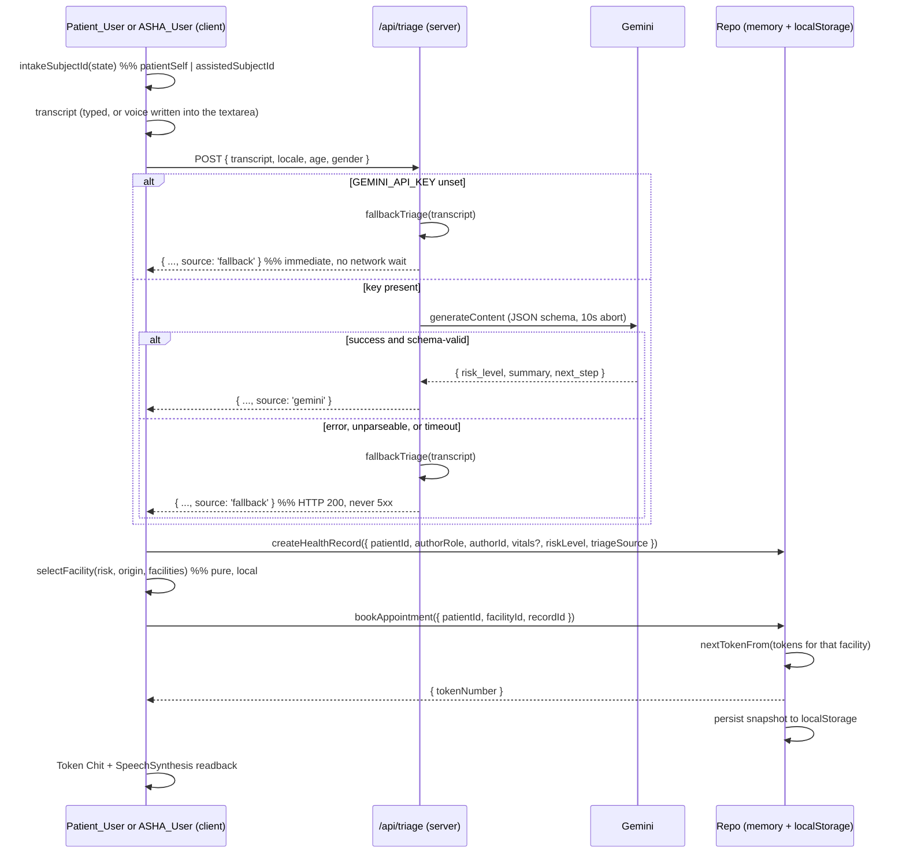
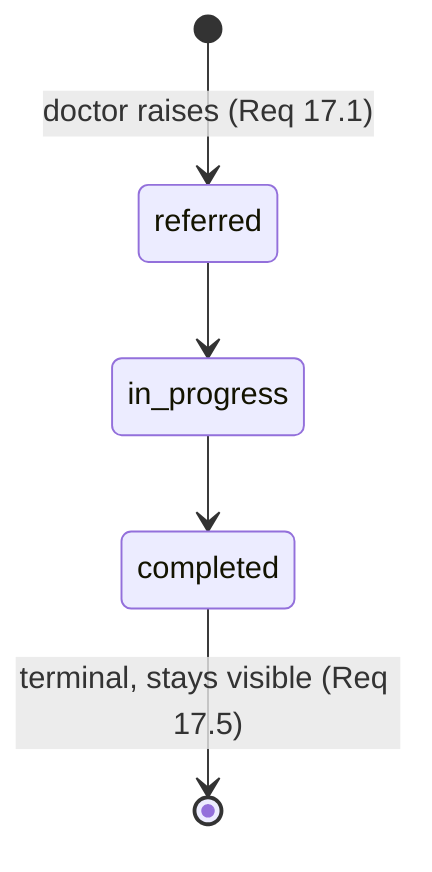

# Design Document

## Overview

Swasthya Setu is a Next.js 15 App Router PWA. This design targets a **~4 hour build**, so the governing rule throughout is *simplest workable, not most sophisticated*. Where a requirement carries real technical risk, or is knowingly unmet, this document says so at the point of design and again in [Risks and Likely Slippage](#risks-and-likely-slippage).

The product's claim is one continuous record per patient, written by three roles. So the demo path is one narrative, not three features:

- **A. Intake, self and assisted** — a Patient_User enters their own symptoms and gets a risk level, a facility, and a token. An ASHA_User then assists the same patient, adding Vitals to the same Shared_Record.
- **B. Doctor panel** — longitudinal summary across prior visits, a Clinical_Decision recorded distinctly from the AI suggestion, prescription, referral raise.
- **C. Closed loop** — `referred → in_progress → completed` on the board, and the whole thread visible back in the patient's own workspace.

Everything else is deliberately reduced, mocked with a visible badge, or explicitly out of scope per the requirements.

Three design decisions shape almost everything downstream:

1. **One record, three roles, one read.** Every workspace resolves a patient through the same `getPatientTimeline(patientId)` call. Active_Role changes which affordances are offered, never which rows are authoritative. See [Shared Record Resolution](#shared-record-resolution) — that section is the product, not a detail of it.
2. **There is no database. Persistence is a repository seam.** The workspace has no linked Supabase project and no credentials, and infrastructure is explicitly out of budget. So `lib/data/repo.ts` is a plain TypeScript interface and `lib/data/memory-repo.ts` is the single shipped adapter: seeded at module load, mutated in memory, snapshotted to `localStorage`. A Supabase adapter is a later, optional swap behind the same interface and nothing in the app depends on it. The consequences are real and are recorded where they bite — see [Repository Seam](#data-layer--the-repository-seam) and the unmet-requirement entries in Risks.
3. **Every non-trivial rule is a pure function in `lib/`.** Fallback triage, facility selection, token computation, referral transitions, history trimming, timeline merging, subject resolution, and replay ordering are pure modules with no I/O. This is what makes Requirement 21 testable with Vitest and zero mocks. With the memory repo, several of these pure functions are now the *actual* implementation rather than a mirror of server-side logic, which makes the test suite cover more than it used to.

The Gemini key still never reaches the client. Exactly two server route handlers exist (`/api/triage`, `/api/summary`), and both degrade to a deterministic local result when no key is configured.

### Build Posture

| Concern | Decision |
|---|---|
| Rendering | Client-heavy. Server components only for layout shells and the role guard. |
| Data access | `Repo` interface; `memory-repo` adapter, seeded in TypeScript, snapshotted to `localStorage`. No network, no SQL, no migrations. |
| Inference | Two Node runtime route handlers. Text-only payloads (Req 22.4). Deterministic result when `GEMINI_API_KEY` is absent. |
| Styling | Tailwind + a token layer written once, before any screen (Req 2.1, 22.x). |
| Tests | Vitest single-run, `node` environment, pure modules only. |
| Access control | Route-level role guard only. Row level security (Req 3.7) has no substrate and is knowingly unmet. |

---

## Architecture

### Route Groups

Three workspaces, one per role, all of them first-class. `(patient)` is not a preview of the ASHA workspace — it is a place a patient uses alone, and it has its own routes.

```
app/
├── layout.tsx                              Root: fonts, tokens, providers, AppShell
├── page.tsx                                Redirect by Active_Role → /patient | /asha | /doctor | /switch-role
├── global-error.tsx
├── (demo)/
│   └── switch-role/page.tsx                Role_Switcher over the three seeded identities (Req 3.3, 3.8)
├── (patient)/                              layout.tsx guards Active_Role === 'patient'
│   ├── patient/page.tsx                    Home: Token Chit for the next appointment, referral strip, 3 large actions
│   ├── patient/language/page.tsx           Supported_Language chooser → patients.preferred_language  [Req 6.1–6.3]
│   ├── patient/intake/page.tsx             Self-intake: symptoms + age/sex/village. No Patient_Picker.  [FLOW A1]
│   ├── patient/intake/[recordId]/page.tsx  Triage result, next step, readback, Token Chit  [Req 6.5, 6.6]
│   ├── patient/appointments/page.tsx       Appointment + Facility_Type + Token Chit + queue position  [Req 13.1]
│   ├── patient/referrals/page.tsx          Referral_Status for every referral of this patient  [Req 13.2]
│   └── patient/record/page.tsx             Longitudinal timeline, own patient_id only  [Req 13.3, 13.4]
├── (asha)/                                 layout.tsx guards Active_Role === 'asha'
│   ├── asha/page.tsx                       Worklist / today
│   ├── asha/intake/page.tsx                Patient_Picker → Assisted_Session + Voice + Vitals + submit  [FLOW A2]
│   ├── asha/intake/[recordId]/page.tsx     Routing confirmation: facility + Token Chit + readback
│   ├── asha/book/page.tsx                  Explicit booking for the Assisted_Session subject  [Req 12.6, 12.7]
│   ├── asha/scan/page.tsx                  QR camera scan  (Stretch_Capability)
│   └── asha/patients/[id]/page.tsx         Shared_Record timeline + QR render + print  [Req 7.5]
├── (doctor)/                               layout.tsx guards Active_Role === 'doctor'
│   ├── doctor/page.tsx                     Patient queue
│   ├── doctor/patients/[id]/page.tsx       Doctor_Panel: summary, timeline, Clinical_Decision, Rx, refer  [FLOW B]
│   └── doctor/referrals/page.tsx           Referral board  [FLOW C]
├── (mock)/
│   ├── dashboard/page.tsx                  Gov aggregate — Mock_Feature
│   └── teleconsult/page.tsx                Slot booking — Mock_Feature
└── api/
    ├── triage/route.ts                     POST, Node runtime, Gemini + deterministic fallback
    └── summary/route.ts                    POST, Node runtime, Gemini + deterministic template
```

Two structural points about this tree:

- **The patient workspace has no `[id]` segment anywhere.** Every patient route derives its subject from `patientSelf` in the store, so a patient screen has no syntax available for naming another patient. Requirement 13.4's scoping is a property of the route shape, not of a `where` clause someone remembers to add.
- **`(patient)` and `(mock)` sit inside the guarded perimeter** alongside the worker groups. Requirement 18.4's negative constraint — no public unauthenticated route returning patient data, and specifically no `/p/{qr_id}` — has no exceptions, and the route tree is where it is enforced. What the guard cannot do without a server is prove identity; see [Auth_Module](#auth_module).

### Server vs Client

| Logic | Where | Why |
|---|---|---|
| Active_Role read, workspace redirect | `middleware.ts` reading the `ss_active_role` cookie + per-group `layout.tsx` | Guard must run before a workspace renders. |
| Gemini triage call, prompt, timeout, parse | `app/api/triage/route.ts` | Key must not reach the client (Req 22.4). |
| Gemini summary call, template composition | `app/api/summary/route.ts` | Same. |
| `fallbackTriage()` | Pure module, imported by **both** the route handler and the client | Route handler uses it when Gemini fails or no key is set; client uses it when the network is gone. |
| `selectFacility()`, `nextTokenFrom()`, `advanceReferral()`, `trimHistory()`, `buildTimeline()`, `intakeSubjectId()` | Pure modules, imported by client | No I/O, so they run offline and test without mocks. |
| Token *assignment* | `memoryRepo.bookAppointment()`, which calls `nextTokenFrom()` | Single-client store, no concurrent writers — see [Token_Number](#token_number-and-the-race-that-no-longer-exists). |
| All patient-data reads/writes | Client, through the `Repo` interface | One seam. One interception point for the queued-write path. |
| SpeechRecognition / SpeechSynthesis | Client only | Browser APIs. |
| QR generate / scan | Client only | Canvas + `getUserMedia`. |
| Write queue | Client page context, plain module state + the repo's own snapshot | No service worker, no IndexedDB; see [Offline Tolerance](#offline-tolerance). |

### State Ownership

The repo is authoritative for all nine entities. Zustand holds only what the repo should not — who is looking, and what they are looking at.

```ts
type Role = 'patient' | 'asha' | 'doctor';

interface AppState {
  // ——— identity and role (Req 3.3, 3.4) ———
  activeRole: Role | null;                // null → the guard sends you to /switch-role
  identity: { id: string; displayName: string } | null;   // the seeded identity for activeRole
  patientSelf: string | null;             // the Patient_User's OWN patients.id. Set only for role 'patient'.
  assistedSubjectId: string | null;       // the Assisted_Session subject. Set only for role 'asha'.
  workerFacilityId: string | null;        // origin for selectFacility when role is 'asha' or 'doctor'

  facilities: Facility[];                 // cached list, needed for local routing

  // ——— UI ———
  locale: 'en-IN' | 'hi-IN';

  // ——— ephemeral flow state ———
  lastTriage: TriageResult | null;        // survives intake → confirmation without a refetch
  voice: { listening: boolean; interim: string; supported: boolean };

  // ——— mirrors of queue state, never the source of truth ———
  pendingCount: number;
  failedCount: number;
  online: boolean;                        // navigator.onLine
  simulatedOffline: boolean;              // demo toggle; effective offline = !online || simulatedOffline
}
```

**Subject resolution is one pure function, and it is the only place the intake subject is decided.**

```ts
// lib/state/subject.ts — pure, tested
export function intakeSubjectId(s: Pick<AppState, 'activeRole' | 'patientSelf' | 'assistedSubjectId'>):
  string | null {
  switch (s.activeRole) {
    case 'patient': return s.patientSelf;          // always own id; Patient_Picker is not rendered (Req 5.4)
    case 'asha':    return s.assistedSubjectId;    // null until a patient is picked → capture stays disabled (Req 5.3)
    default:        return null;                   // a Doctor_User does not author intake
  }
}
```

Two things follow from having exactly one resolver. The disabled state of the symptom control (Req 5.3) is `intakeSubjectId(s) === null`, one expression rather than a per-role condition. And a Patient_User cannot be pointed at another patient, because the patient branch never reads a route param.

Rules that keep this from rotting:

- Nothing that belongs in an entity is duplicated into Zustand. `lastTriage` is the one deliberate exception, and it is a convenience mirror of a row that already exists.
- `patientSelf` is set from the seeded identity when Active_Role becomes `patient` and cleared on every role change. `assistedSubjectId` likewise. Leaking one role's subject into another role's session is the obvious bug here, and clearing on switch is the cheap prevention.
- **Active_Role never selects a data source.** It selects a workspace and a set of affordances. Every read still resolves to the same `patient_id` keyed rows (Req 3.4, 4.6).
- `pendingCount` / `failedCount` are recomputed from the queue by a single `refreshQueueCounters()` after every queue mutation. Never incremented by hand.
- Persisted slices: `locale`, `activeRole` (mirrored to the `ss_active_role` cookie so `middleware.ts` can read it). `assistedSubjectId` is deliberately **not** persisted — a stale subject across reloads is a bug source with no upside.

### Data Flow, Flow A

Identical for a Patient_User and an ASHA_User except for two things: who resolves as the subject, and whether Vitals are present. That is the whole point — one intake path, two entry points.



The `authorRole` / `authorId` pair on the write is Record_Author (Req 4.3). It is a required argument of `createHealthRecord`, not an optional field, so an unattributed record cannot be constructed.

### Environment

```
GEMINI_API_KEY                  # server only, never NEXT_PUBLIC_. Absent → deterministic local results.
NEXT_PUBLIC_DEMO_HELPERS=1      # reveals the labelled demo-helper affordances
```

That is the entire environment. No Supabase URL, no anon key, no service-role key, because there is no backend to hold credentials for. A build cloned onto a fresh machine with an empty `.env` runs the full demo path — every beat, with `source: 'fallback'` labels on the AI plates. Zero-config startup is worth more in a hackathon than a live model call, and the seam means the model call is additive rather than load-bearing.

---

## Data Model

The nine entities of Requirement 1.1 are unchanged in shape. What changed is the substrate: they are declared once as TypeScript types in `lib/data/types.ts` and held by the memory repo, not as Postgres DDL. Requirement 1.1 names *Supabase Postgres tables* specifically, so its letter is knowingly unmet — the entity set, the column set, and every constraint below are preserved exactly, and each type maps one-to-one onto the table it describes if a Supabase adapter is ever built. That gap is recorded again in [Risks](#knowingly-unmet-requirements).

### Unions

```ts
export type Role               = 'patient' | 'asha' | 'doctor';
export type FacilityType       = 'phc' | 'chc' | 'district_hospital';
export type RiskLevel          = 'low' | 'medium' | 'high';
export type ReferralStatus     = 'referred' | 'in_progress' | 'completed';
export type AppointmentStatus  = 'scheduled' | 'checked_in' | 'completed' | 'cancelled';
export type SupportedLanguage  = 'en-IN' | 'hi-IN';
export type NotificationType   = 'appointment' | 'emergency' | 'referral' | 'teleconsult';
export type NotificationChannel = 'sms' | 'ivr' | 'push' | 'in_app';
export type TriageSource       = 'gemini' | 'fallback';
```

`SupportedLanguage` is how Requirement 22.2's "exclude every other locale" becomes structural rather than aspirational — a third locale is a type error at every call site, which is a stronger guarantee than the enum it replaces, and it is checked at build time rather than on insert.

`Role` now carries three members. It is the same union used by Active_Role, by `health_workers.role`, and by `health_records.author_role`, so the three uses cannot drift apart.

### Entities

```ts
// 1. facilities
export interface Facility {
  id: string;
  name: string;
  location: string;              // "lat,lng" decimal degrees, e.g. '20.7453,78.6022'
  locationLabel: string;         // human string for display, e.g. 'Sevagram, Wardha'
  type: FacilityType;
  currentQueueLength: number;    // >= 0
  createdAt: string;             // ISO 8601
}

// 2. health_workers
export interface HealthWorker {
  id: string;
  fullName: string;
  role: Extract<Role, 'asha' | 'doctor'>;   // a Patient_User is not a worker
  facilityId: string | null;
  createdAt: string;
}

// 3. patients
export interface Patient {
  id: string;
  fullName: string;
  age: number | null;            // 0..120
  gender: string | null;
  village: string | null;
  district: string;              // default 'Wardha'
  phone: string | null;
  preferredLanguage: SupportedLanguage;
  qrId: string;                  // unique
  createdAt: string;
}

// Vitals — six typed scalars, grouped for ergonomics, NOT an opaque blob (Req 8)
export interface Vitals {
  bpSystolic:  number | null;    // mmHg
  bpDiastolic: number | null;    // mmHg
  pulseBpm:    number | null;
  tempC:       number | null;
  spo2Pct:     number | null;
  weightKg:    number | null;
}

// 4. health_records — the Shared_Record spine
export interface HealthRecord {
  id: string;
  patientId: string;

  // ——— Record_Author (Req 4.3) ———
  authorRole: Role;              // 'patient' | 'asha' | 'doctor'
  authorId: string;              // patients.id for a Patient_User, health_workers.id otherwise

  symptoms: string;
  vitals: Vitals | null;         // null when no Vitals value was submitted (Req 8.3, 8.4)

  // ——— AI suggestion. Written once at intake, never overwritten. ———
  aiTriageSummary: string | null;
  riskLevel: RiskLevel;
  triageSource: TriageSource;

  // ——— Clinical_Decision. Separate fields, all null until a Doctor_User records one (Req 15.3) ———
  clinicalDecisionAssessment: string | null;
  clinicalDecisionPlan:       string | null;
  clinicalDecisionRisk:       RiskLevel | null;   // may differ from riskLevel (Req 15.5)
  clinicalDecisionBy:         string | null;      // health_workers.id of the deciding Doctor_User
  clinicalDecisionAt:         string | null;      // ISO 8601

  timestamp: string;             // ISO 8601
}

// 5. appointments
export interface Appointment {
  id: string;
  patientId: string;
  facilityId: string;
  recordId: string | null;
  tokenNumber: number;           // > 0, unique per facilityId
  status: AppointmentStatus;
  isTeleconsult: boolean;        // Mock_Feature slot (Req 20.2)
  createdAt: string;
}

// 6. referrals
export interface Referral {
  id: string;
  patientId: string;
  fromFacility: string;
  toFacilityOrSpecialist: string;
  reason: string | null;
  status: ReferralStatus;
  raisedBy: string | null;
  createdAt: string;
  updatedAt: string;
}

// 7. prescriptions
export interface Prescription {
  id: string;
  recordId: string;
  medicines: string;             // non-blank (Req 16.2)
  dosage: string | null;
  notes: string | null;
  prescribedBy: string | null;
  createdAt: string;
}

// 8. medicine_stock
export interface MedicineStock {
  id: string;
  facilityId: string;
  medicine: string;
  quantity: number;              // >= 0
  updatedAt: string;
}

// 9. notifications
export interface AppNotification {
  id: string;
  patientId: string | null;
  type: NotificationType;
  channel: NotificationChannel;
  payload: Record<string, unknown>;
  createdAt: string;
}
```

Constraints that were `check` clauses are now validated in the repo's write methods and, where a user can trigger them, at the form layer: `age` in 0–120, `tokenNumber > 0`, `quantity >= 0`, `currentQueueLength >= 0`, non-blank `medicines`, unique `qrId`, and unique `(facilityId, tokenNumber)`. Losing the storage-layer backstop is a real reduction and it is priced in — the repo is the only writer, so a single validation point is defensible here in a way it would not be with multiple clients.

Notes on the fields that are not literally in Requirement 1 but are load-bearing:

- **`healthRecords.authorRole` + `authorId`** — Record_Author (Req 4.3). Two fields rather than one because the timeline labels by role (`ASHA`, `Doctor`, `Self`) while attribution needs the identity, and because `authorRole` is what the affordance layer reads. Both are required arguments of `createHealthRecord`, so an unattributed record is unconstructable.
- **`healthRecords.vitals`** — Requirement 8 asks for five measurements. **Chosen representation: six discrete nullable numeric fields, grouped under one `vitals` object.** Not a `jsonb`-style blob. The justification is short: Requirement 8.5 demands *field-level* validation on a non-numeric entry while retaining the other values, and Requirement 8.6 demands per-field display — both of those want each measurement to be an independently typed, independently nullable slot. A blob makes every read `unknown`, pushes validation into a runtime schema check, and buys flexibility the requirement explicitly does not need, since Requirement 8.1 fixes the field set at five and it will not grow in this build. Blood pressure splits into `bpSystolic` / `bpDiastolic` because "150/96" is two measurements wearing one label, and storing it as a string would make it the one vital that cannot be validated as numeric. The grouping under `vitals` is TypeScript ergonomics only — in a Postgres swap these are six nullable `numeric` columns on `health_records`, not one `jsonb` column.
- **`healthRecords.clinicalDecision*`** — Requirement 15.3 requires the Clinical_Decision to live in fields *separate from* `aiTriageSummary` and `riskLevel`, with both retained. Five separate nullable fields deliver that structurally: `recordClinicalDecision()` accepts only these five and physically cannot write the AI fields, so "the AI value is retained" is a consequence of the method signature rather than a rule someone honours. `clinicalDecisionRisk` being independently nullable is what makes Requirement 15.5's side-by-side divergence renderable — two values, two sources, neither overwriting the other.
- **`healthRecords.triageSource`** — Requirement 9.4 requires the fallback label to be visible. If the flag lives only in React state it disappears on reload, so it is stored.
- **`facilities.locationLabel`** — `location` carries machine-readable coordinates so `selectFacility()` can compute distance; the display string is separate.
- **`appointments.isTeleconsult`** — the mocked teleconsultation slot (Req 20.2) reuses `appointments` plus a notification row rather than introducing a tenth entity.

`health_records` is append-only for its intake fields and update-in-place for its decision fields only. There is no other mutation path on it.

---

## Data Layer — The Repository Seam

There is no Supabase project linked to this workspace, no credentials, and no MCP surface to create either. Infrastructure was explicitly ruled out of the budget and mock data was authorised. So rather than design a persistence layer that cannot be built, this design puts a **seam** where the database was: one interface, one shipped adapter, and an explicit note about what a real backend would add.

Three files, in dependency order.

### `lib/data/repo.ts` — the interface

A plain TypeScript interface. Every method is `async` even though the shipped adapter never awaits anything, so that a network-backed adapter is a drop-in and no call site changes shape.

```ts
export interface Repo {
  // ——— reference data ———
  listFacilities(): Promise<Facility[]>;
  getFacility(id: string): Promise<Facility | null>;
  listMedicineStock(facilityId?: string): Promise<MedicineStock[]>;

  // ——— demo identities (Req 3.1) ———
  listIdentities(): Promise<DemoIdentity[]>;
  getIdentity(role: Role): Promise<DemoIdentity>;

  // ——— patients ———
  listPatients(): Promise<Patient[]>;                              // Patient_Picker (Req 5.2)
  getPatient(id: string): Promise<Patient | null>;
  findPatientByQrId(qrId: string): Promise<Patient | null>;        // Req 18.2, 18.3
  createPatient(input: NewPatient): Promise<Patient>;              // Req 5.2, 7.3
  setPreferredLanguage(id: string, lang: SupportedLanguage): Promise<Patient>;   // Req 6.2

  // ——— health records ———
  createHealthRecord(input: NewHealthRecord): Promise<HealthRecord>;
  listHealthRecords(patientId: string): Promise<HealthRecord[]>;    // newest first
  getHealthRecord(id: string): Promise<HealthRecord | null>;
  recordClinicalDecision(
    recordId: string,
    decision: ClinicalDecisionInput,                               // assessment, plan, risk?, by
  ): Promise<Result<HealthRecord, ValidationError>>;                // Req 15.2, 15.3, 15.6

  // ——— prescriptions ———
  createPrescription(input: NewPrescription): Promise<Result<Prescription, ValidationError>>;
  listPrescriptionsForPatient(patientId: string): Promise<Prescription[]>;

  // ——— appointments ———
  bookAppointment(input: NewAppointment): Promise<Appointment>;     // assigns Token_Number
  listAppointments(patientId: string): Promise<Appointment[]>;
  latestAppointment(patientId: string): Promise<Appointment | null>;   // Req 13.1

  // ——— referrals ———
  raiseReferral(input: NewReferral): Promise<Referral>;             // Req 17.1
  listReferrals(patientId?: string): Promise<Referral[]>;           // all → board; scoped → Req 13.2
  advanceReferralStatus(
    id: string,
    to: ReferralStatus,
  ): Promise<Result<Referral, TransitionRejection>>;                // Req 17.3, 17.4

  // ——— notifications ———
  createNotification(input: NewNotification): Promise<AppNotification>;
  listNotifications(patientId?: string): Promise<AppNotification[]>;

  // ——— the one read every workspace shares (Req 4.x, 13.3, 14.1) ———
  getPatientTimeline(patientId: string): Promise<TimelineEntry[]>;

  // ——— doctor queue ———
  listDoctorQueue(): Promise<DoctorQueueRow[]>;                     // patient + latest record + risk

  // ——— demo control ———
  reset(): Promise<void>;                                           // discard snapshot, reseed
}

export interface DemoIdentity {
  role: Role;
  id: string;              // patients.id for 'patient', health_workers.id for 'asha' | 'doctor'
  displayName: string;
  facilityId: string | null;
  patientId: string | null;   // set only for the Patient_User → becomes patientSelf
}
```

Two shapes worth naming. `Result<T, E>` is a discriminated union (`{ ok: true; value: T } | { ok: false; error: E }`), used wherever a write can be legitimately refused — an illegal referral transition, an empty assessment, a blank `medicines`. Refusals are values, not exceptions, so the caller cannot forget to handle one and the pure validators stay testable. And **`getPatientTimeline` is deliberately the widest method on the interface**, because it is the method that carries the product's claim; see [Shared Record Resolution](#shared-record-resolution).

**What each workspace reads.** Same rows, different projections:

| Workspace | Reads |
|---|---|
| Patient | `getPatient(patientSelf)`, `latestAppointment`, `listReferrals(patientSelf)`, `getPatientTimeline(patientSelf)` |
| ASHA | `listPatients`, `findPatientByQrId`, `listFacilities`, `getPatientTimeline(assistedSubjectId)` |
| Doctor | `listDoctorQueue`, `getPatientTimeline(routeParamId)`, `listReferrals()`, `listMedicineStock` |

Every patient-scoped read takes a `patientId` and nothing else. There is no `listAllHealthRecords()` on the interface, so a screen cannot accidentally render another patient's data — the absence is the control.

### Access control, stated honestly

The route guard is now the **only** access control in the product. There is no server, so there is nothing that can deny a read after the client decides to make it.

- **Requirement 3.7 (row level security on every table) is knowingly unmet.** It has no substrate. Nothing partially satisfies it and this design does not pretend otherwise.
- **The RLS half of Requirement 18.4 is knowingly unmet** for the same reason. The other half of 18.4 — *no public unauthenticated QR landing route, no `/p/{qr_id}`* — is fully met and is met structurally; see [QR_Module](#qr_module).
- **Requirement 3.6 (patient-scoped queries) and 13.4 still hold and still matter.** They are enforced by the shape of the interface and the shape of the patient route tree: patient screens read `patientSelf` from the store, no patient route accepts an id, and no repo method returns cross-patient patient data. That is real engineering, not a placeholder — it is just not a security boundary, and calling it one would be dishonest.

Both gaps are restated in [Knowingly Unmet Requirements](#knowingly-unmet-requirements).

### What the database used to enforce, and where it went

Removing Postgres removes four enforcement mechanisms. Each one is accounted for rather than quietly dropped.

| Was enforced by | Now enforced by | Honest status |
|---|---|---|
| RLS policies (Req 3.7) | Nothing | **Unmet.** Route guard only, and the guard proves nothing. |
| `referrals_transition_guard` trigger (Req 17.4) | `advanceReferral()`, called by `advanceReferralStatus()` | Met, single layer. See [Referral State Machine](#referral-state-machine). |
| `unique (facility_id, token_number)` + advisory lock (Req 12.3) | `nextTokenFrom()` inside `bookAppointment()` | Met, and the race is gone with the concurrency. See [Token_Number](#token_number-and-the-race-that-no-longer-exists). |
| `check` constraints (age, quantity, non-blank medicines) | Pure validators called by the repo's write methods | Met at the only writer. No second line of defence. |

The pattern is the same in every row: the rule was already a pure function in `lib/`, and the database was the second mechanism. Losing the second mechanism is a genuine reduction in a multi-client system and costs nothing in a single-client demo. Both halves of that sentence are true and both are stated on purpose.

### `lib/data/seed.ts` — the dataset, in TypeScript

One module, one exported `buildSeed(): Db` function returning a fresh object graph. No SQL, no migrations, no `supabase/` directory, no `scripts/seed-auth.ts`. The Wardha scenario is unchanged; only the file format is.

Stable ids as exported constants, because tests, the demo script, and the identity table all reference them:

```ts
export const F_PHC_SEVAGRAM   = 'fac-phc-sevagram';
export const F_CHC_WARDHA     = 'fac-chc-wardha';
export const F_DH_WARDHA      = 'fac-dh-wardha';
export const W_ASHA_SUNITA    = 'hw-asha-sunita';
export const W_DOC_ANAND      = 'hw-doc-anand';
export const P_KAMLA          = 'pat-kamla-bai';
```

Readable string ids rather than UUIDs. Nothing in the app requires UUID shape, and `pat-kamla-bai` in a devtools inspector during a live demo is worth more than format purity. Newly created rows use `crypto.randomUUID()`.

**Facilities — and the coordinate fix.** The previous seed gave PHC Sevagram and CHC Wardha the *same* coordinates, `20.7453,78.6022`. That made the routing demo compute a 0.0 km distance to CHC Wardha and meant the haversine was never actually exercised — the "nearest eligible facility" claim was being made by a function that had no distances to compare. Sevagram and Wardha city are roughly 8 km apart in reality, and the seed now says so:

```ts
facilities: [
  { id: F_PHC_SEVAGRAM, name: 'PHC Sevagram',             location: '20.7333,78.6833',
    locationLabel: 'Sevagram, Wardha',    type: 'phc',               currentQueueLength: 4  },
  { id: F_CHC_WARDHA,   name: 'CHC Wardha',               location: '20.7453,78.6022',
    locationLabel: 'Wardha City',         type: 'chc',               currentQueueLength: 13 },
  { id: F_DH_WARDHA,    name: 'District Hospital Wardha', location: '20.7508,78.5931',
    locationLabel: 'Civil Lines, Wardha', type: 'district_hospital', currentQueueLength: 22 },
]
```

Distances from the ASHA's origin at PHC Sevagram, which is what the demo actually computes: **CHC Wardha 8.5 km, District Hospital Wardha 9.6 km.** Two consequences that matter. The confirmation plate now shows a real number instead of `0.0 km`. And the HIGH-risk case, whose eligible set is `{chc, district_hospital}`, genuinely *chooses* CHC Wardha at 8.5 km over the district hospital at 9.6 km — so the demo's central routing claim is now demonstrated by the function rather than asserted by the seed. The margin is deliberately close but unambiguous, which is also what makes the `select-facility` tie-break tests meaningful.

**The rest of the scenario**, unchanged in substance:

- **Kamla Bai, 34, Sevagram, Wardha**, `preferredLanguage: 'hi-IN'`, `qrId: 'SS-WRD-KAMLA-7F3A'`.
- **Three prior `health_records`** for Kamla spread over ~10 months, with distinct symptoms, `aiTriageSummary`, `riskLevel`, and `timestamp` — enough for a Longitudinal_Summary to reference prior visits (Req 1.3). Each one carries `authorRole: 'asha'`, `authorId: W_ASHA_SUNITA`, so the timeline has real Record_Author variety before the demo adds a patient-authored and a doctor-decided entry. One of the three carries Vitals and one carries a stored Clinical_Decision, so the doctor panel and the patient timeline both render their full layouts on first load rather than only after the demo has walked the whole path.
- **Three facilities, two Facility_Types** (Req 1.4) — `phc`, `chc`, `district_hospital`, so all three tiers exist.
- **`medicineStock`** rows for all three facilities (Req 1.5), with a seeded reorder threshold so the mocked stock chart has a heuristic to apply.
- **Thirteen prior `appointments` at CHC Wardha holding tokens 1–13**, so the demo's next token is **14**. Explicit `tokenNumber` values, which is safe because `nextTokenFrom` derives from `max` rather than from a counter.
- **Three demo identities** (Req 3.1): Patient_User → Kamla (`patientId: P_KAMLA`), ASHA_User → Sunita Tai at PHC Sevagram, Doctor_User → Dr. Anand Deshmukh at CHC Wardha. No emails, no passwords, no `auth.users`.

**Requirement 1.6 (idempotent reseed)** is now trivially true and worth one sentence: `buildSeed()` is a pure function returning a fresh graph, so calling it twice produces two structurally identical objects and cannot change a row count. The upsert-on-constant-primary-key argument the SQL seed needed no longer applies because there is nothing to conflict with. A Vitest test asserts `deepEqual(buildSeed(), buildSeed())` and per-entity counts, which is cheaper and stronger than the manual "seed twice and compare" check it replaces.

### `lib/data/memory-repo.ts` — the single shipped adapter

```ts
const SNAPSHOT_KEY = 'ss:db:v1';

let db: Db = load();

function load(): Db {
  if (typeof window === 'undefined') return buildSeed();          // SSR pass: seed only, never persisted
  try {
    const raw = window.localStorage.getItem(SNAPSHOT_KEY);
    if (!raw) return buildSeed();
    const snap = JSON.parse(raw) as Snapshot;
    if (snap.version !== SNAPSHOT_VERSION) return buildSeed();     // shape changed → discard, reseed
    return snap.db;
  } catch {
    return buildSeed();                                            // corrupt snapshot is not a demo-stopper
  }
}

function persist(): void {
  if (typeof window === 'undefined') return;
  try {
    window.localStorage.setItem(SNAPSHOT_KEY, JSON.stringify({ version: SNAPSHOT_VERSION, db }));
  } catch { /* quota or private mode: the in-memory graph still works for this session */ }
}
```

The design decisions inside this file, each with its reason:

- **Seeded at module load, snapshotted after every write.** A reload keeps state, which is what makes the demo narrative survivable — the presenter can refresh between role switches without losing the record they just created.
- **`SNAPSHOT_VERSION` gates the snapshot.** During a 4-hour build the entity shape changes several times, and a stale snapshot from an earlier shape is exactly the failure that eats twenty minutes at the worst moment. Bumping the constant discards it. This is the single most valuable line in the file.
- **Every failure path falls back to `buildSeed()`.** Missing key, unparseable JSON, version mismatch, `localStorage` unavailable in private mode — all of them land on a working seeded demo rather than an error. There is no state in which the app has no data.
- **Writes mutate `db` then call `persist()` synchronously.** No debounce. Writes are user-initiated and rare, `JSON.stringify` over a graph this size is sub-millisecond, and a debounce introduces a window where a reload loses the last write.
- **Reads return structural copies**, not live references into `db`. A React component holding a reference into the store and mutating it is a bug class that costs more to debug than the copy costs to make.
- **All methods `async`.** Nothing awaits, but every call site is already `await`ed, so swapping in a network adapter changes one import.
- **`reset()`** removes the snapshot key, reassigns `db = buildSeed()`, and returns. The **"Reset demo data"** control sits in the App_Shell under the Role_Switcher: a labelled button that calls `repo.reset()`, clears `activeRole`, and reloads to `/switch-role`. It carries a caption saying it discards everything created during the session. This exists because a demo gets run more than once and the second run should start from the same place as the first.

### The later Supabase adapter

`lib/data/supabase-repo.ts` **is not written.** It is named here so the seam has a stated purpose:

- Every entity type maps one-to-one onto the table it describes, so the DDL is a mechanical translation.
- `getPatientTimeline` becomes four scoped selects plus the same pure `buildTimeline()` merge, or one view.
- `bookAppointment` becomes a compute-and-insert in one statement plus `unique (facility_id, token_number)`; see [Token_Number](#token_number-and-the-race-that-no-longer-exists).
- `advanceReferralStatus` keeps `advanceReferral()` and gains a `before update` trigger as a second mechanism.
- RLS policies are what would actually satisfy Requirement 3.7 and the access-control half of 18.4.

Nothing in the app imports it, references it, or degrades without it. That is the entire value of the seam: the missing backend is a swap, not a rewrite, and the demo does not wait on it.

---

## Shared Record Resolution

This is the product's central claim, so it gets its own section rather than a paragraph inside a component. Everything else in this document is a feature. This is the thesis: *symptoms, vitals, history, decisions, and referrals follow the patient instead of resetting at each facility.* Requirement 4 exists to make that claim testable, and the design has to make it structural or it is marketing.

### One record, and what makes it one

There is exactly one Shared_Record per `patients` row (Req 4.1). Not one per role, not one per facility, not one per encounter type. Concretely:

- Every write from every role is keyed to `patientId` and nothing else (Req 4.2). No role prefix, no facility partition, no per-role table.
- There is **no per-role copy of patient data anywhere in the repo** (Req 4.6). The interface makes this checkable: there is no `getAshaRecordsFor`, no `getPatientVisibleRecords`, no `doctorView` — one method per entity, and one timeline read.
- Every entry carries a Record_Author (Req 4.3) so the *provenance* of an entry is visible while the *ownership* of the record stays with the patient. That distinction is the whole trick. A patient-authored entry and a doctor-authored entry sit in the same thread, differently labelled, equally permanent.

### `getPatientTimeline(patientId)` — one read, three workspaces

Four entity types describe a patient's history and they are stored separately for good reasons. But nobody experiences care as four lists. So the repo exposes one read that merges them into a single chronological thread, and **all three workspaces call it.**

```ts
export type TimelineEntry =
  | { kind: 'record';       at: string; author: Author; record: HealthRecord;
                            prescriptions: Prescription[] }
  | { kind: 'appointment';  at: string; author: Author; appointment: Appointment; facility: Facility }
  | { kind: 'referral';     at: string; author: Author; referral: Referral;
                            fromFacility: Facility }
  | { kind: 'decision';     at: string; author: Author; recordId: string;
                            assessment: string; plan: string | null; risk: RiskLevel | null };

export interface Author { role: Role; id: string; displayName: string; isSelf: boolean }
```

Four notes on that union, because each one is a decision:

- **`prescriptions` hang off their record rather than forming their own entry.** A prescription without its complaint is not information a clinician or a patient can use, and Requirement 16.3 wants the prescription rendered *on* the record view. One `record` entry carries the complaint, the vitals, the AI suggestion, the decision, and the medicines — which is how a visit actually reads.
- **`decision` is its own entry even though it lives on a `health_records` row.** Requirement 15.2 stores a decision with its own timestamp, and that timestamp is usually days after the intake. Collapsing it into the intake entry would place the doctor's decision at the wrong point in the patient's history and would hide the interval between complaint and decision, which is often the clinically interesting part. So the decision appears twice: inline on its record for context, and as a dated thread entry for chronology.
- **`author.isSelf`** is computed against the viewing role, and it is the only field in the timeline that depends on who is looking. It exists so the patient timeline can label an entry `आपने / YOU` while the ASHA and doctor views label the same entry `रोगी / PATIENT`. The *data* is identical; one boolean drives one label.
- **`at` is the sort key for every variant**, so the merge is one comparison and the ordering is total.

The merge itself is pure and lives in `lib/data/timeline.ts`:

```ts
export function buildTimeline(input: {
  records: HealthRecord[]; prescriptions: Prescription[];
  referrals: Referral[];   appointments: Appointment[];
  facilities: Facility[];  identities: DemoIdentity[];
  patient: Patient;        viewerRole: Role;
}): TimelineEntry[];       // newest first, total order, stable on ties
```

The repo method is a thin read of four collections plus this call. So the claim "all three roles see the same record" is verified by a unit test over a pure function rather than by clicking through three workspaces — which is the only way it stays verified after the third refactor.

### Same data, different affordances

Active_Role changes what you can *do*, never what you can *see* about the patient in front of you. The affordance matrix is the whole of the role model:

| Capability | Patient_User | ASHA_User | Doctor_User | Req |
|---|---|---|---|---|
| Read the timeline | own record only | subject patient | any queued patient | 4.4, 4.5, 13.3, 14.1 |
| Choose Supported_Language | ✔ own preference | ✔ per subject | — | 6.1–6.3 |
| Author symptom intake | ✔ for self | ✔ for subject | — | 5.1, 6.4, 7.2 |
| Enter Vitals | — | ✔ | — | 8.1 |
| Patient_Picker / register a patient | — | ✔ | — | 5.2, 7.3 |
| Book an appointment explicitly | — | ✔ | — | 12.6, 12.7 |
| Record a Clinical_Decision | — | — | ✔ | 15.1 |
| Prescribe | — | — | ✔ | 16.1 |
| Raise a referral | — | — | ✔ | 17.1 |
| Advance a Referral_Status | — | ✔ | ✔ | 17.3 |
| Scan a QR identity | — | ✔ | ✔ | 18.2 |

Implemented as one declarative map, not scattered conditionals:

```ts
// lib/auth/capabilities.ts — pure, tested
export const CAPABILITIES: Record<Role, ReadonlySet<Capability>> = { /* the table above */ };
export function can(role: Role | null, cap: Capability): boolean;
```

`can()` drives whether a control renders, and the repo write methods take an author whose role is checked against the same map. One source of truth for the matrix means a capability cannot be offered in one workspace and forgotten in another. It is not a security boundary — see [Access control, stated honestly](#access-control-stated-honestly) — it is a correctness boundary, and that is the honest description.

### Write-then-visible, without a subscription

Requirement 7.4 and 13.5 both ask that a write by one role appear in another role's view. With a single in-memory store this is not a synchronisation problem at all: `db` is one object, and a role switch remounts the workspace, which re-reads it. The requirement's own wording — *"on the next load"* (13.5) — is satisfied by ordinary navigation.

What this design does **not** do is claim live cross-tab propagation. Two browser tabs hold two module instances and will not see each other's writes until a reload rehydrates from `localStorage`. A `storage` event listener would fix it in about ten lines and is not in the budget; the demo runs in one tab. Recorded here rather than discovered on stage.

### The one read the patient workspace is allowed to make

```ts
// hooks/usePatientTimeline.ts  — the patient workspace's ONLY timeline entry point
export function usePatientTimeline() {
  const patientSelf = useStore(s => s.patientSelf);
  return useQueryish(() => patientSelf ? repo.getPatientTimeline(patientSelf) : Promise.resolve([]));
}
```

It takes no argument. A patient screen has no syntax for naming another patient, no route param to pass, and no repo method that returns unscoped patient data. Requirements 3.6 and 13.4 are satisfied by the absence of a capability rather than by the presence of a filter, which is the only version of that guarantee that survives a hurried refactor.

---

## Clinical Decision vs AI Suggestion

Requirement 10 and Requirement 15 together make one demand: the record must show *the AI advising and the clinician deciding*, and it must be impossible to confuse the two. That is a rendering problem and a storage problem, and both halves are structural here.

### Storage: two field groups that cannot overwrite each other

Already established in the [Data Model](#entities), restated because it is the foundation. `aiTriageSummary`, `riskLevel`, and `triageSource` are written once at intake. `clinicalDecisionAssessment`, `clinicalDecisionPlan`, `clinicalDecisionRisk`, `clinicalDecisionBy`, and `clinicalDecisionAt` are written only by `recordClinicalDecision()`, whose parameter type contains none of the AI fields. Requirement 15.3's "SHALL retain the stored `ai_triage_summary` and `risk_level`" is therefore not a rule the code follows — it is a shape the code cannot violate.

Validation: an empty or whitespace-only assessment is refused with a field-level `ValidationError` and no write occurs (Req 15.6). Same pure validator family as `validatePrescription`, same `Result` return, same test pattern.

### Rendering: two labelled blocks, decision first

One component pair, used everywhere either value appears — the doctor panel, the ASHA timeline, and the patient record view (Req 10.4, 15.4, 15.7).

```
┌─ plate, --ss-elev-raised, rail --ss-action ────────────────────┐
│ ⬛ डॉक्टर का निर्णय / DOCTOR'S DECISION                        │   <BiLabel>, --ss-text-title
│ Dr. Anand Deshmukh · 14 Mar, 4:20 pm                           │   --ss-text-caption
│ Assessment ……………………………………………………                                │   --ss-text-field
│ Plan ………………………………………………………………                                  │   --ss-text-field
│ [ RiskBadge: octagon HIGH ]                                    │
└────────────────────────────────────────────────────────────────┘
┌─ plate, --ss-elev-plate, rail = risk colour ───────────────────┐
│ ◻ AI सुझाव / AI SUGGESTION            [fallback label if any]  │   <BiLabel>, --ss-text-body
│ [ RiskBadge: triangle MEDIUM ]                                 │
│ Summary ………………………………………………………                                  │   --ss-text-body
│ ⓘ AI-generated decision support. Not a medical diagnosis.      │   <AdvisoryNote>, always
└────────────────────────────────────────────────────────────────┘
```

The prominence rule of Requirement 10.5 — decision at prominence *equal to or greater than* the AI suggestion — is delivered by four channels at once, so no single style tweak can silently invert it:

| Channel | Clinical_Decision | Triage_Result |
|---|---|---|
| Order | first in DOM and in reading order | second |
| Type scale | `--ss-text-title` heading, `--ss-text-field` body | `--ss-text-body` heading and body |
| Elevation | `--ss-elev-raised` (5 px) | `--ss-elev-plate` (3 px) |
| Rail | `--ss-action` — the product's decision colour | the risk colour, which is a *state*, not an authority |
| Advisory notice | none — a clinician's words need no disclaimer | `<AdvisoryNote>`, rendered from inside the component |

The label wording carries real weight and is fixed in the dictionaries, not written per screen: the AI block says **suggestion**, the decision block says **decision**, in both locales, on every surface (Req 10.4). And Requirement 10.6's patient-facing framing lives in the patient variant of the AI block, which appends one sentence: *"A doctor will record the deciding assessment."*

**Before a decision exists**, the layout does not shift. The decision plate renders in an empty state at the same position and size: for a Doctor_User it holds the assessment/plan form (Req 15.1); for a Patient_User or ASHA_User it reads `डॉक्टर के निर्णय की प्रतीक्षा / AWAITING DOCTOR'S DECISION`. The AI block never moves up into the primary slot, because the primary slot belongs to clinical authority whether or not it has been exercised yet.

### Divergent risk levels, side by side

Requirement 15.5 is the interesting case: the doctor's risk assessment differs from the AI's. The wrong implementations are (a) overwrite `riskLevel` with the doctor's value, and (b) hide the AI value once a decision exists. Both destroy the record of what the AI actually said, which is the only thing that makes the AI auditable.

So both render, adjacent, each captioned with its source:

```
┌─ divergence plate ────────────────────────────────────────┐
│  ⬛ HIGH              ◻ MEDIUM                            │
│  डॉक्टर / DOCTOR      AI सुझाव / AI SUGGESTION            │
│  Recorded assessment differs from the AI triage priority.  │
└───────────────────────────────────────────────────────────┘
```

Two `<RiskBadge>` instances, full shape-and-bars treatment on both so neither is visually demoted below legibility, the doctor's on the leading edge. The notice line is a statement of fact, not a warning — divergence is the system working, not an error.

The decision about *what* to render is a pure function, which is what makes it testable and what keeps the prominence rule out of JSX conditionals:

```ts
// lib/records/presentation.ts — pure, tested
export function decisionPresentation(r: HealthRecord): {
  blocks: ['decision', 'ai'];                      // always this order (Req 10.5)
  decisionState: 'recorded' | 'awaiting';
  divergent: boolean;                              // both risks present and unequal (Req 15.5)
  aiRisk: RiskLevel;                               // always the stored value, never the decision's
  decisionRisk: RiskLevel | null;
};
```

`aiRisk` reads `r.riskLevel` unconditionally. There is no branch in which the function returns the decision's risk in the AI slot, which is the machine-checkable form of "the Triage_Engine value is retained" (Req 15.5).

---

## Components and Interfaces

### Auth_Module

There is no authentication. There is a **Role_Switcher over three seeded identities**, and this section says so plainly rather than dressing it as auth.

The previous design had two email/password logins plus a dev-only `Patient_View_Switch`. That is gone. Requirement 3 now makes Patient_User a first-class role reached the same way the other two are, and Requirement 3.2 excludes signup, email verification, and OTP from the MVP outright — so a credential form would be ceremony over a `switch` statement. What replaces it:

**`app/(demo)/switch-role/page.tsx` — the Role_Switcher.**

Three large plates, one per seeded identity, each showing the role, the name, and what that role can do:

| Plate | Identity | Lands on |
|---|---|---|
| रोगी / PATIENT | Kamla Bai, 34, Sevagram | `/patient` |
| आशा / ASHA | Sunita Tai, PHC Sevagram | `/asha` |
| डॉक्टर / DOCTOR | Dr. Anand Deshmukh, CHC Wardha | `/doctor` |

Selecting a plate does four things and nothing else (Req 3.3):

```ts
async function selectRole(role: Role) {
  const identity = await repo.getIdentity(role);
  store.setActiveRole(role, identity);        // sets activeRole, identity, patientSelf, workerFacilityId
  store.clearSubject();                       // assistedSubjectId → null on every switch
  document.cookie = `ss_active_role=${role}; path=/; samesite=lax`;
  router.replace(landingRouteFor(role));      // pure function, total over Role
}
```

`patientSelf` is populated only for the patient identity, from `DemoIdentity.patientId`. `assistedSubjectId` is cleared unconditionally — carrying one role's subject into another role's session is the obvious bug in a three-role switcher and clearing on every switch is the cheap prevention.

**The Role_Switcher is also in the App_Shell**, as a compact control in the chrome, because the demo switches roles five times in three minutes and a round trip through a dedicated page each time would cost more of the three minutes than it is worth.

**Active_Role never selects a data source.** It selects a workspace and, through `can()`, a set of affordances. Every read still resolves to the same `patientId`-keyed rows. That sentence is the load-bearing constraint of the whole role model (Req 3.4) and it is restated in [Shared Record Resolution](#shared-record-resolution) because it is the one thing a later refactor is most likely to break.

**Guard behaviour, kept as designed.**

- `middleware.ts`, matcher `['/patient/:path*', '/asha/:path*', '/doctor/:path*', '/dashboard/:path*', '/teleconsult/:path*']`. It reads the `ss_active_role` cookie. Absent or unparseable → redirect to `/switch-role?next=<pathname>` (Req 3.5). Present but pointing at another role's group → redirect to that role's own landing route, so an ASHA hitting `/doctor` lands on `/asha` (Req 3.3).
- Each route-group `layout.tsx` re-checks `activeRole` from the store on mount and redirects on mismatch. Two checks rather than one because the cookie is the only thing `middleware.ts` can see and the store is the only thing the components use; letting them disagree is a bug that renders a workspace with the wrong affordances.
- `app/page.tsx` redirects by `landingRouteFor(activeRole)`, or to `/switch-role` when Active_Role is null.
- `landingRouteFor(role: Role): string` is pure and total over the union, so a fourth role would be a compile error rather than a blank screen.

**Why the cookie exists.** `activeRole` lives in the Zustand store, and a server-side `middleware.ts` cannot read `localStorage`. Mirroring the role into a cookie is what keeps the guard running before a workspace renders instead of after it flashes. The cookie is written on every switch and cleared on reset.

**The explicit note, and it is rendered in the product, not just written here.**

The Role_Switcher displays a persistent notice, and a `role` chip in the App_Shell chrome links back to it (Req 3.8):

> *Role switching is a hackathon demonstration affordance, not authentication. Any visitor can select any role. The stored data is seeded demonstration data only — no real patient records.*

This is not hedging. It is the accurate description of the mechanism, and the mechanism is the right one for a 4-hour demo of a three-role care journey. What it is not is a security boundary: the cookie is client-writable, the guard is a redirect, and there is no server to deny anything. Requirement 3.7's row level security is what would make role separation real, and it is knowingly unmet — recorded at [Access control](#access-control-stated-honestly) and again in [Risks](#knowingly-unmet-requirements). Saying "demo affordance" once in a notice and then designing as though it were auth is the failure mode this paragraph exists to prevent.

### Voice_Module

`lib/voice/useSpeechRecognition.ts` and `lib/voice/useSpeechSynthesis.ts`. Both client-only hooks.

**SpeechRecognition lifecycle.** The instance is created lazily on first `start()`, never during render:

```ts
const Ctor = window.SpeechRecognition ?? window.webkitSpeechRecognition;   // undefined outside Chromium
rec.lang            = locale;      // 'hi-IN' | 'en-IN'
rec.continuous      = false;       // one utterance per press; continuous mode drifts and drains battery
rec.interimResults  = true;        // Req 5.6 requires the interim transcript on screen
rec.maxAlternatives = 1;
```

| Event | Handling |
|---|---|
| `onstart` | `voice.listening = true`, mic button enters its active state |
| `onresult` | Walk `event.results` from `event.resultIndex`. `isFinal` chunks append to `finalTranscript`; the rest replaces `voice.interim`. Both render, final in full ink, interim in muted ink. |
| `onerror` | Map `not-allowed`, `service-not-allowed`, `no-speech`, `audio-capture`, `network`, `aborted` to a locale message key. Anything other than `no-speech` / `aborted` flips the panel to text entry with the transcript so far preserved (Req 5.8). |
| `onend` | `voice.listening = false`. **No auto-restart** — restart loops re-prompt for permission and burn battery. |
| unmount | `rec.abort()`, then null every handler. |

**Interim rendering detail.** Devanagari has no true italic, so interim text is distinguished by `--ink-muted` plus a dashed underline, never by `font-style: italic`. A synthesised oblique on Devanagari looks broken.

**Text fallback (Req 5.7, 5.8).** The textarea is not a hidden alternative path: the transcript field is *always* an editable textarea, and the mic is an input method that writes into it. So "edit before submission" and "no SpeechRecognition support" are the same code path, and `supported === false` simply means the mic button renders disabled with an explanatory caption. This is also what makes Requirement 5.5 — typed entry as the *core* intake path for both a Patient_User and an ASHA_User — true by construction rather than by a second screen.

**SpeechSynthesis (Req 11).** `getVoices()` populates asynchronously, so the hook waits for `voiceschanged` before selecting. Voice selection uses the **patient's** `preferred_language` (Req 11.2), which is deliberately a different locale source from the UI locale — a Hindi-speaking patient can be served by an ASHA running the English UI. Selection order: exact `lang` match → `lang.startsWith('hi')` → none. On none, the guidance renders as on-screen text plus a visible "audio unavailable on this device" notice (Req 11.3). The spoken string is assembled as `advisory + summary + next step` so Requirement 10.3 cannot be forgotten — the advisory is part of the utterance builder, not the caller's responsibility.

**Both intake roles share this module unchanged.** A Patient_User speaking their own symptoms and an ASHA_User speaking a patient's symptoms are the same call; only `intakeSubjectId` differs. The one role-dependent detail is that the patient workspace renders the mic at `--ss-touch-field` with a larger caption, per the [role distinction](#three-roles-one-visual-language) note.

**The honest risk.** `SpeechRecognition` is Chromium-only. Safari exposes a partial implementation behind different behaviour and Firefox ships none, so on a judge's iPhone the voice beat does not exist. Chrome's implementation also streams the audio to Google's speech service — that is Chrome's behaviour, not our inference call, and Requirement 22.4 (text-only to Gemini) still holds, but it should be stated plainly rather than glossed. And `hi-IN` accuracy on rural-accented Hindi with medical vocabulary is genuinely unreliable; code-mixed speech ("BP high hai", "साँस नहीं आ रही") transcribes inconsistently.

Mitigations, in order of value:

1. The transcript is always editable, so a bad transcription is a correction, not a dead end.
2. `fallbackTriage` matches **both** Devanagari and Latin-script Hindi keywords, so a romanised mis-transcription (`saans`, `seene mein dard`) still triages correctly.
3. The demo runs on Android Chrome with a rehearsed phrase, and the browser requirement is stated up front.
4. A **"Use sample complaint"** button, visible only under `NEXT_PUBLIC_DEMO_HELPERS`, fills the textarea with the demo Hindi phrase. It carries a Mock_Badge. It is a labelled demo helper, not a hidden fake.

### Triage_Engine

`app/api/triage/route.ts`, `export const runtime = 'nodejs'`.

**Request / response contract**

```ts
// POST /api/triage
interface TriageRequest  { transcript: string; locale: 'en-IN'|'hi-IN'; age?: number; gender?: string }
interface TriageResponse {
  risk_level: 'low' | 'medium' | 'high';
  summary: string;                 // plain language, patient-facing
  recommended_next_step: string;
  source: 'gemini' | 'fallback';
  red_flags?: string[];
}
```

The route **always answers HTTP 200** on a well-formed request. Requirement 9.3 requires the intake flow to complete, so an internal Gemini failure is not a client-visible error status — it is a `source: 'fallback'` response. A malformed request body is the only 4xx.

**No key configured is the first branch, not a failure.** The workspace ships without `GEMINI_API_KEY`, and waiting 10 seconds to discover that is the wrong behaviour:

```ts
if (!process.env.GEMINI_API_KEY) {
  return json({ ...fallbackTriage(transcript, locale), source: 'fallback' });   // immediate
}
```

No network attempt, no `AbortController`, no timer. The intake completes in a few milliseconds with a visibly labelled keyword-based assessment (Req 9.4), which means the demo path works on a clean clone with an empty `.env`. Requirement 9.1's letter — *send the transcript to the Gemini API* — is met only when a key is present; that conditional is recorded in [Risks](#knowingly-unmet-requirements) rather than glossed. The deterministic path is not a degraded mode here, it is the default mode, and the label tells the truth about which one ran.

**Prompt shape.** A `systemInstruction` plus a single user part. No chat history, no tools, no examples beyond the rubric.

```
SYSTEM
You are a triage support assistant for community health workers in rural India.
You do not diagnose. You classify urgency and restate the complaint in plain language.

Rules:
- Never name a disease or condition. Describe severity, urgency, and what to watch for.
- Write `summary` and `recommended_next_step` in the language of the LOCALE field, at a
  reading level suitable for a person with limited literacy. Two short sentences maximum.
- Classify risk_level using this rubric ONLY:
    high   — possible airway, breathing, circulation, neurological, obstetric, or
             severe-bleeding emergency; or symptoms that could deteriorate within hours.
    medium — persistent, worsening, or systemic symptoms needing clinician review in
             1–2 days, but no immediate threat.
    low    — self-limiting minor complaints manageable at a primary health centre.
- When the transcript is too vague to classify, choose medium. Never guess low.
- Output JSON matching the provided schema. No prose outside the JSON.

USER
LOCALE: hi-IN
PATIENT: age 34, female
TRANSCRIPT: """<verbatim transcript>"""
```

**Structured output.** `gemini-2.5-flash`, `generationConfig.responseMimeType = "application/json"` with a `responseSchema`. Constraining the response at the API level removes most parse failures before they happen, which matters more than any prompt wording.

```json
{
  "type": "object",
  "properties": {
    "risk_level":            { "type": "string", "enum": ["low", "medium", "high"] },
    "summary":               { "type": "string" },
    "recommended_next_step": { "type": "string" },
    "red_flags":             { "type": "array", "items": { "type": "string" } }
  },
  "required": ["risk_level", "summary", "recommended_next_step"],
  "propertyOrdering": ["risk_level", "summary", "recommended_next_step", "red_flags"]
}
```

`temperature: 0.2`, `maxOutputTokens: 400`. Plain `fetch` against `generativelanguage.googleapis.com/v1beta/models/gemini-2.5-flash:generateContent` — no SDK, one less dependency to fight.

**Timeout.** One `AbortController`, 10 000 ms, cleared in a `finally`. The abort path and the error path converge on the same handler, so there is exactly one place that can fall back.

```ts
const ac = new AbortController();
const timer = setTimeout(() => ac.abort('triage-timeout'), 10_000);
try {
  const raw = await fetch(GEMINI_URL, { method: 'POST', signal: ac.signal, body });
  if (!raw.ok) throw new Error(`gemini-http-${raw.status}`);
  const text = extractText(await raw.json());          // pure
  const parsed = parseTriage(text);                    // pure: JSON.parse + zod, returns Result
  if (!parsed.ok) throw new Error('gemini-unparseable');
  return json({ ...parsed.value, source: 'gemini' });
} catch {
  return json({ ...fallbackTriage(transcript, locale), source: 'fallback' });
} finally {
  clearTimeout(timer);
}
```

`parseTriage` is its own pure module (`lib/triage/parse.ts`) precisely so the unparseable branch is testable without a network: feed it truncated JSON, a fenced code block, an out-of-enum `risk_level`, and an empty string.

**Progress indicator (Req 9.5).** The submit button enters a determinate-feeling waiting state with a text label ("Assessing… / आकलन हो रहा है…"). A skeleton, not a spinner over content. On the no-key path this is visible for a single frame, which is correct — a spinner that outlives its work is worse than no spinner.

### Fallback_Triage

`lib/triage/fallback.ts` — **pure, zero imports beyond types.** No `fetch`, no `Date.now()`, no randomness. This is what lets Vitest cover Requirement 21.1 with no mocks, and what lets the client call it directly when offline. With no `GEMINI_API_KEY` configured it is also the *primary* triage path rather than the fallback path, which raises the stakes on the keyword table below and is one more reason it is written out in full here.

```ts
export interface TriageResult {
  risk_level: RiskLevel;
  summary: string;
  recommended_next_step: string;
  source: 'fallback';
  matched: string[];              // which keywords fired — surfaced in the UI and asserted in tests
}

export function fallbackTriage(transcript: string, locale: SupportedLanguage = 'hi-IN'): TriageResult;
```

**Normalisation.** `String.prototype.normalize('NFC')` → lowercase → collapse whitespace → strip Latin punctuation and the Devanagari danda (`।`). Matching is substring-based, because Devanagari inflection and compounding make token equality useless (`साँस` appears inside `साँस फूलना`).

**Keyword-to-risk table.** Both scripts for Hindi: Devanagari for correct recognition, Latin transliteration for mis-transcribed or code-mixed speech.

| Risk | English | Hindi (Devanagari) | Hindi (Latin) |
|---|---|---|---|
| `high` | chest pain, breathless, cannot breathe, unconscious, fainted, seizure, convulsion, fits, heavy bleeding, vomiting blood, severe pain, blue lips, paralysis, stroke, slurred speech, stiff neck, snake bite, poison, suicide, labour pain | सीने में दर्द, छाती में दर्द, साँस, दम घुट, बेहोश, दौरा, मिरगी, झटके, खून बह, रक्तस्राव, खून की उल्टी, तेज दर्द, होंठ नीले, लकवा, गर्दन अकड़, साँप ने काटा, ज़हर, आत्महत्या, प्रसव | seene mein dard, chhati mein dard, saans, dum ghut, behosh, daura, jhatke, khoon, lakwa, saanp, zahar, prasav |
| `medium` | fever, persistent cough, vomiting, diarrhoea, dehydration, swelling, rash, weakness, dizziness, burning urination, ear discharge, weight loss, persistent headache | बुखार, खाँसी, उल्टी, दस्त, सूजन, चकत्ते, दाने, कमजोरी, चक्कर, पेशाब में जलन, कान से पानी, वजन कम, सिरदर्द | bukhar, khansi, ulti, dast, sujan, kamzori, chakkar, peshab mein jalan, sirdard |
| `low` | cold, runny nose, mild cough, body ache, acidity, gas, constipation, minor cut, itching, checkup, refill | जुकाम, सर्दी, नाक बहना, हल्की खाँसी, बदन दर्द, पेट में गैस, कब्ज, छोटा घाव, खुजली, जाँच, दवा लेने | jukam, sardi, halki khansi, badan dard, gas, kabz, khujli, jaanch |

**Precedence.** `high` if any high keyword matches, else `medium`, else `low`, else — no match at all — **`medium`**.

The no-match default is `medium`, not `low`. In triage the asymmetric error is under-triage: sending a deteriorating patient to a PHC is a worse failure than sending a mild case to a CHC. An unclassifiable complaint carries no information, and the safe reading of no information is "a clinician should look at this."

**Composite rule.** One only, kept to one so the table stays testable: a pregnancy term (`गर्भ`, `प्रसव`, `pregnan`, `garbh`) co-occurring with any bleeding or pain term escalates to `high` regardless of the individual matches.

**Documented limitation.** No negation handling. "no chest pain" / "सीने में दर्द नहीं" classifies `high`. A negation window is a genuine NLP problem, not a 4-hour one, and over-triage is the safe direction for the error. This is recorded rather than hidden, and the UI always shows the ASHA which keywords fired (`matched`) so a human can see the reason and override by editing the transcript.

**Summaries** are locale-keyed templates, one per risk level, interpolated with the matched terms. Deterministic, so the tests assert on exact strings.

### Routing_Engine

`lib/routing/select-facility.ts` and `lib/routing/token.ts`. Both pure.

**Risk to facility type**

| Risk | Eligible types | Rule |
|---|---|---|
| `low` | `phc` | nearest PHC; if the district has none, nearest CHC |
| `medium` | `chc` | nearest CHC; if none, nearest district hospital |
| `high` | `chc`, `district_hospital` | nearest **among both** — stabilise at the nearest capable facility |

`high` deliberately does not force the district hospital. Sending a possible cardiac case past a closer CHC to reach a district hospital costs time that matters. Both are treated as capable of receiving an emergency, and distance decides. This is also why the demo's HIGH-risk case routes to **CHC Wardha**: with the corrected seed coordinates it sits **8.5 km** from PHC Sevagram against the district hospital's **9.6 km**, so the choice is made by the distance computation rather than declared by the seed. The old seed gave both Sevagram facilities identical coordinates, which produced a `0.0 km` reading and meant this rule was never actually exercised — see [the seed](#libdataseedts--the-dataset-in-typescript).

**Nearest match.** `facilities.location` holds `"lat,lng"`. Distance is haversine over parsed coordinates — eight lines, pure, no PostGIS, no dependency.

Origin resolution, in order:

1. **ASHA_User or Doctor_User** → the coordinates of `workerFacilityId`. The ASHA is by definition at her assigned village.
2. **Patient_User** → the seeded coordinates for the patient's `village`, from a `VILLAGE_COORDS` map in `seed.ts`, falling back to the patient's district centre. A patient doing self-intake has no assigned facility, so this branch is new with Requirement 6 and it is the only role-dependent line in the routing path.
3. **Neither resolves** → the first eligible facility, distance `0`, degenerate case.

**No device geolocation.** A permission prompt mid-demo and 50–500 m accuracy variance on a mid-range Android buy nothing here, and asking a patient for location permission in the first thirty seconds of using a health app is a poor trade for a number the village name already supplies.

`selectFacility` itself is unchanged: it takes an `origin: LatLng` and knows nothing about roles. Origin *resolution* is the caller's job, which is why adding a third role did not touch the pure function or its tests.

```ts
export function selectFacility(
  risk: RiskLevel,
  origin: LatLng,
  facilities: Facility[],
): { facility: Facility; distanceKm: number; eligibleType: FacilityType } | null;
```

Tie-breaks are fully specified so tests are stable: distance ascending → eligible-type priority order → `name` ascending → `id` ascending. Returns `null` only when `facilities` is empty; the caller then surfaces an error plate rather than writing a partial appointment.

#### Token_Number, and the race that no longer exists

The previous design spent three mechanisms on a concurrency problem — a unique constraint, a `security definer` PL/pgSQL function holding a per-facility advisory lock, and a client retry on `23505`. With the database gone, so is the problem, and the honest thing is to say that rather than keep the machinery.

```ts
export function nextTokenFrom(existing: number[]): number;   // [] → 1 ; [1,2,3] → 4 ; [7] → 8
```

**This is now the actual implementation, not a mirror of it.** `memoryRepo.bookAppointment()` reads the token numbers already held at that facility out of `db.appointments`, calls `nextTokenFrom`, and writes the row — all inside one synchronous JavaScript turn, on a single-threaded client, against a store with exactly one writer. There is no read-modify-write window because there is nothing that can interleave between the read and the write. So there is no race to defend against, and the two remaining defences would be defending against nothing.

The consequence for the test suite is a genuine improvement, and it is the reason to be precise here. Requirement 21.3's Vitest coverage of `nextTokenFrom` previously proved a rule that the *SQL* separately re-implemented — the test covered the pure function and the database covered the demo, and the old design said so explicitly. Now the test covers the code that actually runs. Seeded tokens 1–13 at CHC Wardha plus `nextTokenFrom` returning 14 is the same assertion the demo makes on stage.

**A real deployment reintroduces the race, and this is where the fix goes.** Any multi-client backend — Supabase or otherwise — restores exactly the original problem: two ASHAs submitting to CHC Wardha in the same second both read 13 and both write 14, and two patients holding token 14 is a real defect in a queue-management product, not a cosmetic one. The fix has two parts and the first is already written:

1. **`nextTokenFrom` stays**, unchanged, as the rule. It moves from being the implementation to being the specification the storage layer must uphold — which is why it is worth keeping pure and tested even though nothing currently threatens it.
2. **A uniqueness check on `(facility_id, token_number)`**, plus computing and inserting in a single statement so no client round trip sits between the two. That is the actual correctness guarantee; serialisation (an advisory lock, a transaction, a queue) is an optimisation that keeps the constraint from being hit rather than a substitute for it.

Rejected alternatives, recorded because they will be proposed again: a per-facility sequence needs DDL per facility and leaves gaps on rollback; `currentQueueLength + 1` reuses a mutable counter that other features also write; a client-side lock is not a lock.

**Requirement 12.6 and 12.7 — explicit ASHA booking.** Two callers, one method. Automatic assignment follows a persisted Triage_Result with the facility chosen by `selectFacility`. Explicit booking at `/asha/book` lets the ASHA_User pick the `facilityId` for the Assisted_Session subject, and calls the same `bookAppointment` with `recordId: null`. Token assignment, the chit, and the queue increment are identical — the only difference is who chose the facility, which is exactly the difference the requirement draws.

**Offline behaviour is simpler than it was.** A token no longer needs a network round trip, so the "Token pending — assigned on sync" placeholder is gone: an offline intake gets a real token immediately, because the token authority is in the page. Requirement 12.4's confirmation display is therefore complete on both paths, which is a small honest gain from losing the database. The queued-write path still exists for ordering and visible pending state; see [Offline Tolerance](#offline-tolerance).

**Realtime.** Requirement 12.5 excludes any Supabase Realtime subscription from the routing path. There is no Supabase, so this is unmet-by-vacuity rather than by design — `currentQueueLength` is read once from the seeded row for display only, which is the behaviour the requirement was protecting.

### Longitudinal_Summary

`app/api/summary/route.ts`, `runtime = 'nodejs'`.

**What gets sent.** The Doctor_Panel has already read the patient's records through the repo, so it posts a trimmed history to the route rather than making the route reach for storage it has no access to. The route stays stateless and holds no credentials beyond the Gemini key. The trade-off is that the client chooses what to summarise, which is acceptable because there is no privilege boundary here to protect, and it keeps the route a pure text-in-text-out function.

Vitals are deliberately **not** sent. The summary is over the narrative history; measurements render on the timeline where the doctor reads them directly, at full precision, next to the complaint they belong to. Paraphrasing a blood pressure through a language model is a way to introduce an error into the one part of the record that has none.

```ts
interface SummaryRequest {
  patient: { age?: number; gender?: string; preferredLanguage: SupportedLanguage };
  history: Array<{ date: string; risk: RiskLevel; symptoms: string; summary: string | null; medicines?: string }>;
}
interface SummaryResponse {
  summary: string | null;
  unavailable: boolean;
  source: 'gemini' | 'template';
  reason?: 'timeout' | 'error' | 'unparseable' | 'empty-history';
}
```

`source` mirrors the triage route's `source` field and drives the same labelling discipline: a template summary is visibly marked as one, exactly as a fallback triage result is (Req 9.4's reasoning applied to Requirement 14). A machine-composed summary that looks like a model-written summary is the kind of small dishonesty that costs a hackathon its credibility during questions.

**Trimming — `lib/summary/trim.ts`, pure and tested.**

1. Sort by `date` descending. The most recent record is never dropped.
2. Keep at most **8** records.
3. Truncate `symptoms` and `summary` to 240 characters each, `medicines` to 120, on a word boundary with an ellipsis.
4. Attach `medicines` only to the 3 most recent records that have a prescription.
5. Hard-cap the serialised payload at **4 000 characters**. While over cap, drop the oldest record. If a single record exceeds the cap alone, truncate its fields further.

Deterministic and content-independent, which is what makes it a property test rather than a fixture test.

**Prompt shape.** Same discipline as triage: no diagnosis, no new clinical claims, reference visits by date, three to five sentences, name any trend visible across visits, output plain text (not JSON — there is only one field, and a schema for one string is ceremony). Written in the patient's `preferred_language`.

**No key configured — the deterministic template.** The doctor beat is the demo's centre of gravity, and a blank summary plate on a clean clone would gut it. So when `GEMINI_API_KEY` is absent the route composes a summary locally and returns it as a success, not as a failure:

```ts
if (!process.env.GEMINI_API_KEY) {
  const trimmed = trimHistory(history);
  return json({ summary: composeTemplateSummary(trimmed, patient, locale),
                unavailable: false, source: 'template' });
}
```

`composeTemplateSummary` is pure, tested, and runs over the **same `trimHistory` output** the Gemini path uses — so both paths summarise exactly the same records and the trim rules stay the single place recency is decided. It is a locale-keyed sentence assembler over facts already in the record, and it makes no claim the rows do not already contain:

1. Span and volume — *"Four visits recorded between 12 May 2025 and 14 March 2026."*
2. Highest risk and when — *"Highest recorded triage priority: HIGH, on 14 March 2026."*
3. Recurring complaints — the symptom terms appearing in more than one visit, by frequency, capped at three. Term extraction reuses the `fallbackTriage` normaliser and keyword table, so it needs no new vocabulary and inherits the bilingual matching.
4. The current complaint, verbatim from the trimmed newest record.
5. Prescriptions, if any — *"Medicines recorded at 2 of these visits."*
6. A closing line stating what it is: *"Composed from recorded visits. No clinical inference."*

Every sentence is a restatement of stored data. There is no synthesis, no trend claim, and no inference — which is precisely why it is safe to show a doctor without a model behind it, and why it carries the `source: 'template'` label and the same `<AdvisoryNote>`. Deterministic output also means it is assertable on exact strings in Vitest.

**Graceful degradation (Req 14.3).** Same 10 s `AbortController`, on the Gemini path only. On timeout, HTTP error, unparseable output, or empty output with a key present, the route returns `{ summary: null, unavailable: true, source: 'gemini', reason }` with **HTTP 200**. A genuine Gemini failure still reports as a failure — the template is the no-key path, not a silent cover for a broken model call, because a presenter needs to know which one happened. The panel then renders:

- the raw `health_records` list in reverse chronological order — which Requirement 14.1 requires anyway, so the degraded state is the normal state minus one plate, never a blank screen or an error boundary;
- a notice plate: "AI summary unavailable — showing full visit history";
- one manual **Retry summary** button. No automatic retry loop; a doctor pressing a button is better than a hidden retry storm.

The summary is cached in Zustand keyed by `patientId` for the session, so navigating away and back does not re-pay 10 seconds.

**Advisory framing (Req 10.1).** The `<AiSummary>` and `<RiskBadge>` components render `<AdvisoryNote>` internally. A caller cannot render AI output without the advisory notice, because the notice is inside the component rather than beside it at each call site. Structural, not a convention. The template summary is routed through the same `<AiSummary>` component and therefore carries the same notice — it is machine-composed text either way, and the advisory is about provenance, not about which machine.

**Where the decision sits relative to this.** The summary plate is not the top of the doctor panel. The record under review renders its Clinical_Decision block first, then its AI suggestion, then the longitudinal summary as context beneath both. See [Clinical Decision vs AI Suggestion](#clinical-decision-vs-ai-suggestion) for why the ordering is fixed rather than incidental.

### Offline Tolerance

**Why this section is now much smaller.** The previous design built a hand-written service worker plus an IndexedDB write queue. That was the right answer when a write had to survive a network round trip to Supabase and could be lost in between. It is the wrong answer now: with the memory repo, **every write is already local and already durable across a reload**, because the `localStorage` snapshot *is* the persistence layer and it does not care whether the radio is on. An ASHA_User in a village with no signal loses nothing, queue or no queue.

So the queue is not protecting data from loss any more. It is protecting the two things Requirement 19 actually specifies: a truthful connectivity state with a visible unsynced count (19.1, 19.3), and ordered replay (19.4). Naming that precisely turns "build a sync engine" into "build four small pieces", and it is the largest honest reduction in this amendment. The service worker and IndexedDB drop to an [optional note](#optional-the-service-worker-and-indexeddb) at the end.

**1. Connectivity_Banner (Req 19.1).** A full-width plate under the app bar, always rendered, in every workspace. Effective state is one expression:

```ts
const effectivelyOffline = !state.online || state.simulatedOffline;
```

`online` tracks `navigator.onLine` via the `online` / `offline` events. The visual treatment is already specified in [Responsive and Shell](#responsive-and-shell) — quiet `--ss-low` rail when online, ochre ground with the 45° ink hazard-stripe rail when offline — and it is unchanged.

**2. "Simulate offline" — a labelled demo toggle.** A switch in the App_Shell, under `NEXT_PUBLIC_DEMO_HELPERS`, that sets `simulatedOffline`. It exists because airplane mode is a genuinely bad demo instrument: on a laptop it can drop the dev server connection, on a phone it can take several seconds to settle, and either way the presenter is fighting the OS during their own demo. A toggle makes the beat deterministic and repeatable. It carries a caption saying it simulates the offline state rather than disabling the network, because that is what it does.

**3. The queued-write path (Req 19.2, 19.3).** One gate, and every intake write goes through it:

```ts
// lib/offline/write-gate.ts
export async function submitIntake(payload: IntakePayload): Promise<IntakeOutcome> {
  if (effectivelyOffline()) {
    enqueue({ kind: 'intake', payload });      // → module state + snapshot, pending badge increments
    return { queued: true };
  }
  return { queued: false, result: await applyIntake(repo, payload) };
}
```

`applyIntake` is the shared body — `createHealthRecord` then `bookAppointment` — so the online path and the replay path run identical code. A queued intake renders on the confirmation screen with a **pending chip** on the entry and the Pending_Badge count incremented in the nav.

One deliberate difference from the old design: an offline intake still gets a **real Token_Number**, not a placeholder, because the token authority now lives in the page. The `"Token pending — assigned on sync"` state is gone.

**4. Ordered replay (Req 19.4, 19.5).** On the transition to online — the `online` event, a `visibilitychange` check, or the manual **Retry sync** control, never a polling interval — replay walks the queue in ascending `seq` with a sequential `for...of` and `await`s each write. Never `Promise.all`; parallel replay *is* the ordering bug. A module-scope `replayInFlight` flag prevents two events from starting overlapping runs.

On failure the record is **kept**, `attempts` is incremented, `lastError` is stored, `status` becomes `'failed'`, and **the run stops at that record**. Head-of-line blocking is chosen over skip-and-continue: skipping preserves the badge count but breaks the ordering guarantee for every later write on the same patient. The failure count renders beside the pending count.

Worth saying plainly: with a local repo, a replay failure is now nearly unreachable — the writes cannot fail for network reasons, only for validation reasons. The retention path is built anyway because Requirement 19.5 specifies it, because it costs a dozen lines in a pure reducer, and because it is the part a real backend would immediately need.

**5. Scope (Req 19.6).** Queue and replay only. No offline sign-in, no merge conflict resolution, no sync management screen. Requirement 19.6 scopes the queue to an already-signed-in ASHA_User; the path is role-agnostic, so a Patient_User doing self-intake offline is covered by the same gate at no extra cost. That is a superset of what is asked, which is fine — the requirement is a floor.

**Two deviations from Requirement 19's letter, recorded rather than glossed:**

- **19.2 names IndexedDB.** The queue persists to `localStorage`, inside the same snapshot the repo uses, so there is one storage mechanism and one version gate rather than two. The durability guarantee the requirement is protecting is met; the named engine is not. Adding `idb` for a queue that holds at most a few dozen small records would be a dependency and a schema-upgrade path bought for nothing.
- **19.4 says "replay queued writes to Supabase."** Replay is against the `Repo` interface. When a Supabase adapter exists, this sentence becomes literally true with no change to the replay code — which is the point of the seam.

**Record shape**

```ts
interface QueuedWrite {
  seq: number;                   // monotonic counter, assigned on enqueue — IS the submission order
  kind: 'intake';                // the MVP has exactly one queued write kind
  createdAt: string;             // ISO, display only
  payload: {
    patientId: string;           // intakeSubjectId(state) at submit time
    authorRole: Role;            // Record_Author travels with the write (Req 4.3)
    authorId: string;
    symptoms: string;
    vitals: Vitals | null;       // present only for an ASHA_User submission
    riskLevel: RiskLevel;
    aiTriageSummary: string;
    triageSource: TriageSource;  // 'fallback' on every offline write
    facilityId: string;          // resolved locally by selectFacility()
  };
  attempts: number;
  lastError: string | null;
  status: 'pending' | 'failed';
}
```

One `kind` covers both entry points. A Patient_User self-intake and an ASHA_User assisted intake differ only in `authorRole`, `authorId`, and whether `vitals` is null — which is the same "one intake path, two subjects" property that holds everywhere else, and it means the queue did not grow a second code path when the patient role became first-class.

`seq` comes from a counter in the queue's own state, persisted with it, so it survives a reload without needing an autoincrementing store. Monotonic keys are the whole ordering guarantee, and a plain integer delivers it as well as an IndexedDB key does.

**The queue is a pure reducer.** `lib/offline/queue-reducer.ts` holds `enqueue`, `planReplay`, `markFailed`, `markDrained`, and `counters` as pure functions over a `QueueState`. The impure shell is two lines — read the state, write the snapshot. This is what keeps Properties 12 and 13 testable with no fake IndexedDB, and it is unchanged from the previous design apart from `seq` replacing the store key.

**Counters.** `refreshQueueCounters()` recomputes `pendingCount` and `failedCount` from queue state after every mutation and writes both into Zustand. The badge never counts by hand, so it cannot drift.

**Cap.** 50 records. Beyond that, new submissions are refused with a message rather than evicting silently. Losing a captured visit is the one failure this feature exists to prevent.

**Offline triage and routing.** `/api/triage` is unreachable offline, so the client calls `fallbackTriage()` directly — the same pure module the server route uses — and `selectFacility()` against the cached facility list. The submitting user still gets a risk level, a facility, a token, and an advisory label. This is the payoff for making those modules pure and isomorphic: the offline path is not a degraded queue, it is the whole intake decision running locally. With no `GEMINI_API_KEY` configured, the online and offline triage paths are in fact the *same* computation, which makes the offline beat easy to rehearse.

#### Optional: the service worker and IndexedDB

Neither is built. Both are recorded here so the omission is a decision rather than a gap.

- **A service worker** (`public/sw.js`, registered from a client component in the root layout, precaching the shell and never caching `/api/*`) buys PWA installability and an offline cold start. Without it, a hard reload while offline shows the browser's offline page — though the repo snapshot and the queue both survive in `localStorage` and are intact on the next successful load. Build-plugin PWA setups interact with Turbopack and the App Router in ways that can eat 30+ minutes of a 4-hour budget, so this is the first thing cut and the last thing added.
- **IndexedDB** would matter if the queue could grow large or hold binary payloads. It holds at most 50 small JSON records. `localStorage` in the existing snapshot is the cheaper correct answer, as recorded in the deviation note above.

### Referral State Machine

`lib/referral/machine.ts` — pure, no database, no imports.

```ts
export const REFERRAL_TRANSITIONS = {
  referred:    ['in_progress'],
  in_progress: ['completed'],
  completed:   [],
} as const satisfies Record<ReferralStatus, readonly ReferralStatus[]>;

export type TransitionResult =
  | { ok: true;  next: ReferralStatus }
  | { ok: false; reasonKey: 'referral.error.same' | 'referral.error.terminal' | 'referral.error.illegal' };

export function advanceReferral(from: ReferralStatus, to: ReferralStatus): TransitionResult;
export function nextStatus(from: ReferralStatus): ReferralStatus | null;   // drives the board's button
```



Rejections return a **message key**, not a sentence, so the reason is localisable (Req 17.4 requires displaying it) and the tests assert on stable identifiers rather than on copy that will change.

`nextStatus()` drives the board: each card renders exactly one advance button, labelled with the only legal next state, and `completed` cards render none. So illegal transitions are unreachable through the UI.

**`advanceReferral()` is the only enforcement layer.** Stated plainly, because the previous design claimed three — the UI, the pure function, and a Postgres `before update` trigger — and two of those are gone with the database. `repo.advanceReferralStatus(id, to)` calls `advanceReferral(current, to)` and returns the rejection as a `Result` without writing when it fails; there is nothing beneath it. One layer is sufficient here for a specific reason: the repo is the only writer, and the check sits inside it rather than in a caller that could be bypassed. It would *not* be sufficient with multiple clients, and that is exactly what the trigger existed for — so the trigger is named in [the later Supabase adapter](#the-later-supabase-adapter) as the thing that would be added back, not quietly dropped.

The one layer that exists is the pure function, which is also the one Vitest covers (Req 21.2). Test and implementation are now the same code path rather than two implementations of one rule.

### QR_Module

**Generation.** `qrcode` (`toDataURL`) into an `` inside a print-styled plate. Printable via `window.print()` with an `@media print` block that hides chrome and prints the plate, the patient name, the `qrId` as text, and the district (Req 18.1).

**The encoded value is the bare `qrId` string** — `SS-WRD-KAMLA-7F3A` — **not a URL.**

Requirement 18.4 has two halves and they now land very differently, so they are separated here.

**The negative constraint is fully met, structurally, in three layers.** *Swasthya_Setu SHALL NOT ship a public unauthenticated QR landing route, including any `/p/{qr_id}` route:*

1. **No URL in the payload.** A generic phone camera scanning this code sees an opaque string with nowhere to navigate. There is no link to leak, forward, or screenshot. The code is only meaningful to an app that already knows how to resolve it.
2. **No route exists.** There is no `app/p/[qrId]/` segment and no unauthenticated dynamic route anywhere in the tree. Resolution happens inside `/asha/scan`, which sits behind the route guard.
3. **A test asserts the absence.** `tests/no-public-qr-route.test.ts` walks the `app/` directory and fails if any route segment named `p` or any dynamic segment outside the guarded route groups appears. A negative constraint that nothing checks is a constraint that a later commit deletes by accident.

The fourth layer the previous design listed — *RLS grants `anon` nothing* — is gone with the database, and it was the layer doing the security work rather than the structural work. Its removal is why the second half is now unmet.

**The positive access-control half is knowingly unmet.** *Restrict every route that returns patient health data to an authenticated session held by an ASHA_User, a Doctor_User, or the owning Patient_User.* The route guard reads a client-writable cookie and redirects; it does not authenticate, and there is no server-side check behind it. What still holds is worth stating because it is not nothing: no patient data is exposed at a public URL, no health record is reachable without going through the app's own routes, and the patient workspace is scoped by construction. What does not hold is any guarantee against a visitor who chooses a different role. Recorded again in [Knowingly Unmet Requirements](#knowingly-unmet-requirements).

**Scanning.** `html5-qrcode`, mounted only on `/asha/scan` and torn down on unmount so the camera stops. On decode: `repo.findPatientByQrId(value)`.

- Match → navigate to the patient record (Req 18.2).
- No match → a not-found plate, **scanner stays live** for retry (Req 18.3).
- Camera permission denied or `getUserMedia` unavailable → a manual `qrId` text field with the same resolution path. This keeps the beat demonstrable when a camera is unavailable.

`getUserMedia` requires a secure context. `localhost` qualifies; a phone pointed at a laptop's LAN IP does not. The demo build is deployed to HTTPS before the demo — noted again in Risks.

### i18n

The simplest thing that works for exactly two locales, and no framework.

```
lib/i18n/
├── en-IN.ts        export default { 'intake.title': 'New visit', ... }
├── hi-IN.ts        export default { 'intake.title': 'नई विज़िट', ... }
└── index.ts        type MessageKey = keyof typeof enIN ;  useT() ;  t(key, params?)
```

- `en-IN` is the type source: `type MessageKey = keyof typeof enIN`, so a key missing from `hi-IN` is a **TypeScript error**, not a runtime surprise.
- `useT()` reads `locale` from Zustand (persisted to `localStorage`). `t('greeting', { name })` interpolates `{name}`. That is the whole API.
- No `[locale]` route segment, no locale middleware, no `next-intl`. Locale-in-the-URL means touching every route and every link, which is a poor trade for two locales in a 4-hour build.
- `document.documentElement.lang` is set in an effect when locale changes, so screen readers and font selection follow.
- A Vitest test asserts key parity in both directions, which makes the dictionaries self-policing for free.
- Missing key → the key itself in development, the `en-IN` string in production.

**The two locale sources are deliberately separate.** UI locale comes from Zustand (the viewing user's choice). Voice readback locale comes from `patients.preferredLanguage` (Req 11.2). Conflating them is an easy bug: an ASHA who prefers the English UI must still be able to play Hindi guidance to her patient.

**With three roles the split gains a third case, and it resolves cleanly.** A Patient_User's UI locale and their `preferredLanguage` are the same thing, because they are the same person — so `/patient/language` writes both: `repo.setPreferredLanguage(patientSelf, lang)` and `store.setLocale(lang)` in one action (Req 6.2). On a later session the patient's stored `preferredLanguage` is read at mount and applied as the active locale, which satisfies Requirement 6.3 without a separate preferences store. For an ASHA_User or Doctor_User the two stay independent exactly as before. One rule covers all three: **the UI locale is the viewer's, the readback locale is the subject's, and when the viewer is the subject they coincide.**

### Mock Features

All mocked surfaces are wrapped in `<MockPlate>`, which renders the `<MockBadge>` and the dashed treatment together (see [Mock-Badge Treatment](#mock-badge-treatment)). A mocked surface cannot be built without the badge, because the wrapper is the surface.

| Feature | Implementation | Req |
|---|---|---|
| Teleconsultation | `bookAppointment` with `isTeleconsult: true` plus a notification (`type: 'teleconsult'`). Shows the slot. No video session. | 20.2 |
| Ambulance / SOS | `createNotification` (`type: 'emergency'`, `channel: 'sms'`), then renders a simulated dispatch timeline from static steps. | 20.3 |
| Gov dashboard | Aggregates seeded rows client-side: counts by `riskLevel`, by facility, referral throughput. | 20.4 |
| Stock and hotspot charts | CSS bar plates over seeded rows. Heuristic documented on screen: *stock* = `quantity` vs a seeded reorder threshold; *hotspot* = count of health records per village in the last 90 days, bucketed into three bands. Labelled "v1 heuristic over seed data, not a trained model." | 20.5 |
| NGO / fundraising | Not built. Out of scope. | 20.6 |

One note the seam makes worth stating: the dashboard's "aggregate" is now unambiguously an aggregate over the seed, because there is no other source it could be reading. The Mock_Badge on it was always honest; it is now also unavoidable.

---

## Error Handling

One rule underneath the whole table: **no failure produces a blank screen, an infinite spinner, or a silently swallowed exception.** Every catch either recovers to a named degraded state or renders an error plate with a retry.

| Failure | Behaviour | Req |
|---|---|---|
| `GEMINI_API_KEY` unset | `fallbackTriage()` / `composeTemplateSummary()` immediately, labelled `fallback` / `template`. Not an error state. | 9.3, 9.4, 22.5 |
| Gemini triage error / unparseable / >10 s | `fallbackTriage()` result, HTTP 200, fallback label stored and rendered | 9.3, 9.4 |
| Gemini summary error / >10 s (key present) | `{ summary: null, unavailable: true }`, raw record list + notice + manual retry | 14.3 |
| Repo write refused by a validator | `Result` error → field-level message, form state preserved, nothing written | 8.5, 15.6, 16.2 |
| Repo write attempted while effectively offline | Queued by `seq`, pending badge increments, entry shows a pending chip | 19.2, 19.3 |
| `localStorage` snapshot corrupt or version-mismatched | Discard, reseed from `buildSeed()`, show a one-line notice that demo data was reset | 1.6 |
| `localStorage` unavailable (private mode, quota) | In-memory graph only for the session; banner notes that state will not survive a reload | — |
| Active_Role missing on a guarded route | Redirect to `/switch-role?next=<path>` | 3.5 |
| Active_Role mismatched to the route group | Redirect to that role's own landing route | 3.3 |
| Non-numeric Vitals value | Field-level validation message on that field only; every other entered value retained | 8.5 |
| Empty Clinical_Decision assessment | Field-level validation message; no write, AI fields untouched | 15.6 |
| Empty `medicines` | Field-level validation message from `validatePrescription` | 16.2 |
| Illegal referral transition | Rejection plate with localised reason key, no write attempted | 17.4 |
| `SpeechRecognition` absent | Mic disabled with caption, textarea is the primary path | 5.8 |
| `SpeechRecognition` error | Flip to text entry, preserve partial transcript, show mapped message | 5.8 |
| No `SpeechSynthesis` voice for locale | On-screen text plus "audio unavailable on this device" notice | 11.3 |
| Camera denied / unavailable | Manual `qrId` entry field | 18.2 |
| Scanned `qrId` not found | Not-found plate, scanner stays live | 18.3 |
| Patient has no appointment or referral | Empty state naming the next action available to that Patient_User | 13.6 |
| Queue replay failure | Record retained, `status = 'failed'`, failure count displayed, run stops at that record | 19.5 |
| Queue at 50 records | New submissions refused with a message; nothing evicted | — |

Three rows left the table with the database: the `23505` token retry, the "Supabase write fails while online" plate, and the expired-session redirect. None of those failure modes exists any more, and leaving them listed would misdescribe the system.

Boundaries: one `error.tsx` per route group so a doctor-panel crash does not take down the shell, plus `global-error.tsx`. Every error path logs a stable `code` string, which is what makes a five-minute debug session possible during a hackathon.

---

## Visual Design System

This is a committed direction, not a menu. It is written first, before any screen, because a 4-hour build never reaches a polish pass — the token layer *is* the polish pass. Mode is **Operate** for the ASHA and doctor workspaces: the visitor is completing a task, so scanability and state legibility outrank expression, and the identity lives in precise, cheap details that repeat everywhere.

### The Physical Scene

One sentence, because it decides everything else. *An ASHA stands in a courtyard in Sevagram at 11 a.m. in 38 °C glare, holding a mid-range 6.5-inch Android with a scratched screen protector, brightness maxed, one hand on the phone and one on the patient's shoulder, and she has about forty seconds.*

That scene forces the answers: **light ground, not dark** — a near-black UI on an LCD in direct sun becomes a mirror. **No blur, no translucency, no subtle greys** — every one of those is a low-contrast device, and low contrast is what sunlight destroys first. **Flat fills and hard edges.** **Nothing below 18 px in the primary field flows.** These are not aesthetic preferences; they are the environment's requirements, and they happen to also be the cheapest things to build.

### The World

**Indian public-infrastructure enamel signage**, fused with the **shape-coded state indicator** of a vaccine vial monitor.

This is derived from the audience's own visual world, not from a category default. Every person in this product's scene already reads enamel-plate signage fluently: railway platform boards, PHC and dispensary plates, milestone stones, immunisation-day banners. That tradition solved exactly this problem a century ago — bilingual Devanagari-over-Latin, distance-legible at maximum contrast, colour used as a signal rather than as decoration, information on discrete plates rather than in a continuous field. And the token number the routing engine assigns is, culturally, a railway berth number: the audience knows what a number on a chit means.

The second donation is technical. A vaccine vial monitor tells a health worker whether a vial is still good using a **square inside a circle** — the state is readable from geometry, then confirmed by colour. That is precisely the discipline the risk indicator needs.

**What this direction refuses:** the warm-cream-plus-serif-plus-terracotta arrangement, the near-black-plus-neon arrangement, glassmorphism, gradient-filled cards, blur-based elevation, and default shadcn's soft-grey-on-white register. All of them fail the courtyard.

### Palette

Light ground, dark chrome, three signal colours that never do decorative work. Every value below is measured against its actual usage surface, not assumed.

```css
/* ——— Ground and surfaces ——— */
--ss-ground:        #E7EBE9;   /* app background — cool porcelain, not cream            */
--ss-surface:       #FFFFFF;   /* plates                                                */
--ss-sunk:          #D7DEDA;   /* inputs, table stripes, disabled fills                 */

/* ——— Ink ——— */
--ss-ink:           #0E1A17;   /* body, borders, hard shadows                           */
--ss-ink-muted:     #46564F;   /* captions, secondary locale, interim transcript        */

/* ——— Chrome (app bar, side nav) ——— */
--ss-chrome:        #0B3B33;   /* enamel petrol green                                   */
--ss-chrome-fg:     #FFFFFF;
--ss-chrome-muted:  #A9C6BE;

/* ——— Signal: risk levels only, never decoration ——— */
--ss-high:          #B01018;   /* fill; white text on it                                */
--ss-med-fill:      #E4A020;   /* fill; INK text on it — never white                    */
--ss-med-fg:        #7A4A00;   /* the ochre role for glyphs and text on light grounds    */
--ss-low:           #1F6B4A;   /* fill; white text on it                                */

/* ——— Action / wayfinding ——— */
--ss-action:        #14477D;   /* direction-board blue: primary buttons, focus, routing  */
--ss-action-fg:     #FFFFFF;

/* ——— Lines ——— */
--ss-line:          #0E1A17;   /* 2px, every plate and every interactive boundary        */
--ss-line-soft:     #A8B4AF;   /* decorative dividers ONLY — see the rule below          */

--ss-scrim:         rgb(14 26 23 / 0.72);
```

Measured contrast ratios:

| Pair | Ratio | Requirement |
|---|---|---|
| `ink` on `surface` | **18.0 : 1** | body ≥ 4.5 ✓ |
| `ink` on `ground` | **14.8 : 1** | body ✓ |
| `ink` on `sunk` (input text, placeholders) | **13.0 : 1** | body ✓ |
| `ink-muted` on `surface` | **7.8 : 1** | body ✓ |
| `ink-muted` on `sunk` (placeholder) | **5.7 : 1** | body ✓ — no washed-out placeholders |
| `chrome-fg` on `chrome` | **11.8 : 1** | body ✓ |
| `chrome-muted` on `chrome` | **6.5 : 1** | body ✓ |
| white on `high` | **7.2 : 1** | body ✓ |
| `ink` on `med-fill` | **7.9 : 1** | body ✓ |
| white on `low` | **6.4 : 1** | body ✓ |
| white on `action` | **9.4 : 1** | body ✓ |
| `high` / `low` / `action` / `med-fg` as glyph on `surface` | 7.2 / 6.4 / 9.4 / 7.5 : 1 | icon ≥ 3 ✓ |

Two token rules that exist because the maths says so, and both are enforced in review:

- **`--ss-med-fill` (#E4A020) never appears as a foreground.** As a glyph on white it measures **2.2 : 1** and fails the 3 : 1 non-text minimum. Ochre appears only as a *fill with ink on top*. When a medium-risk glyph is needed on a light ground, `--ss-med-fg` (#7A4A00, 7.5 : 1) is the token. This is the single most likely accidental accessibility regression in the build, so it is written down as a rule rather than left to judgement.
- **`--ss-line-soft` (2.1 : 1) is for decorative dividers only, never for the boundary of an interactive control.** Control boundaries take `--ss-line` at 2 px, which satisfies WCAG 1.4.11 with enormous headroom and also happens to be the identity.

Colour strategy: **Restrained** on the content surface, with **Committed** chrome. The petrol-green app bar and the white plates carry the whole layout; the three signal colours appear only where a state exists. No accent colour is ever used decoratively, because in this product a colour patch means something.

### Risk Levels: Four Redundant Channels

Requirement 2.4 asks for contrast. The harder problem is that a red / amber / green scheme fails twice over here — for users with red-green colour vision deficiency, which is the most common form and is never rare in a population this size, and for *everyone* when sunlight washes the panel. So risk is encoded four ways at once, and any single channel is sufficient to read the state.

| Channel | `low` | `medium` | `high` |
|---|---|---|---|
| **Shape** | circle | triangle | **octagon** (the stop sign) |
| **Bars** | ▍ one | ▍▍ two | ▍▍▍ three |
| **Fill** | outlined, ink on white | solid ochre, ink text | solid crimson, white text, **double rule** |
| **Text** | `कम / LOW` | `मध्यम / MEDIUM` | `उच्च / HIGH` |

The octagon is doing real work: it is the one geometry in the set that means *stop* pre-linguistically. Implemented as a single inline SVG with three `d` paths swapped by variant — no icon library needed, no per-screen decision, one `<RiskBadge risk={...} />` everywhere risk is rendered. The badge also renders `<AdvisoryNote>` and the fallback label when `triageSource === 'fallback'`, so Requirements 10.1, 10.2, and 9.4 are satisfied by *using the component* rather than by remembering to.

### Typography

**Typeface: Mukta** (Ek Type, Girish Dalvi — available on Google Fonts). Weights 400 / 600 / 800, `display: swap`, Latin + Devanagari subsets.

This is the load-bearing choice, and it is worth being explicit about why: **most Latin-first webfonts have no Devanagari coverage at all.** Inter, Geist, DM Sans, Plus Jakarta, Outfit, Manrope — none of them draw Devanagari, so specifying one means Hindi silently falls back to whatever the Android system serves, and the two scripts then render at visibly different optical sizes, weights, and baselines on the same line. That mismatch is the single most common way an Indian bilingual UI looks amateur.

Mukta is drawn as **one family across Devanagari and Latin**, proportioned together: matched x-height relative to the Devanagari base line, matched stroke weight, flat open terminals that survive a smudged screen protector, and a large x-height that reads at small sizes on a low-DPI panel. It is a workhorse UI face with a slightly engineered character that suits the signage world, and it is not one of the training-data default faces.

```css
--ss-font-ui: 'Mukta', 'Noto Sans Devanagari', system-ui, sans-serif;
```

One family for everything — Operate mode does not need a display pairing, and weight 800 gives all the voice the signage plates need. Fallback is `Noto Sans Devanagari`, which also draws both scripts. If a fallback ever activates, `@font-face { size-adjust: … }` corrects the optical mismatch; with Mukta present, no per-script adjustment is needed.

**Scale** — fixed rem, ratio ≈ 1.2, named steps. No fluid clamp: users are at consistent DPI, and a heading that shrinks inside a card looks worse, not better.

| Token | Size | Weight | Use |
|---|---|---|---|
| `--ss-text-caption` | 0.8125rem / 13px | 600 | labels, secondary locale line, metadata. Never body. Floor for the product. |
| `--ss-text-body` | 1rem / 16px | 400 | dense doctor-panel body, tables |
| `--ss-text-field` | 1.125rem / 18px | 400 | **default body on every ASHA-facing screen** |
| `--ss-text-title` | 1.375rem / 22px | 600 | card and section titles |
| `--ss-text-headline` | 1.75rem / 28px | 700 | screen titles |
| `--ss-text-display` | 2.5rem / 40px | 800 | risk verdict, facility name on the confirmation plate |
| `--ss-text-token` | 4rem / 64px | 800 | the token number, `font-variant-numeric: tabular-nums` |

**Leading is script-aware**, which is the detail almost every bilingual build misses: Devanagari carries matras above and below the shirorekha and clips at Latin line-heights.

```css
--ss-leading-latin: 1.5;
--ss-leading-deva:  1.7;   /* applied via [lang="hi-IN"] and to any Devanagari-bearing element */
```

Measure: 65–75ch for prose (the AI summary, the advisory notice). Doctor-panel tables may run denser.

### Spacing, Radius, Elevation

```css
/* Spacing — 4px base, named steps, no arbitrary values in components */
--ss-space-1: 4px;   --ss-space-2: 8px;   --ss-space-3: 12px;  --ss-space-4: 16px;
--ss-space-5: 20px;  --ss-space-6: 24px;  --ss-space-8: 32px;  --ss-space-10: 40px;
--ss-space-12: 48px; --ss-space-16: 64px;

/* Touch — Req 2.3 is a floor, not a target */
--ss-touch-min:   44px;   /* every interactive control, no exceptions */
--ss-touch-field: 56px;   /* primary field actions: mic, submit, advance, scan */

/* Radius — near-square. Enamel plates have tooling radii, not pill corners. */
--ss-radius-plate: 4px;
--ss-radius-input: 4px;
--ss-radius-chip:  999px;   /* status chips and the mock badge only */

/* Elevation — hard offset, zero blur. Anywhere. Ever. */
--ss-elev-flat:    none;
--ss-elev-plate:   3px 3px 0 0 var(--ss-ink);
--ss-elev-raised:  5px 5px 0 0 var(--ss-ink);
--ss-elev-pressed: 1px 1px 0 0 var(--ss-ink);   /* + translate(2px, 2px) */

/* Motion — Operate mode: state, not choreography */
--ss-dur-fast: 120ms;
--ss-dur-base: 180ms;
--ss-ease: cubic-bezier(0.2, 0, 0, 1);
```

**Zero blur radius on every shadow** is a deliberate three-way win: it is the identity, it is the only elevation that survives direct sunlight, and it costs a mid-range GPU nothing. Blur-based shadows fail all three.

Focus, which is a field-usability feature and not a checkbox:

```css
:focus-visible { outline: 3px solid var(--ss-ink); outline-offset: 2px; }
.on-chrome :focus-visible { outline-color: #FFFFFF; }
```

An ink ring is maximum contrast against every light surface and every signal fill, so one rule covers the whole product; the chrome scope flips it to white.

### Three Signature Moves

Cheap, reusable, and each one survives 56 px touch targets and icon-first navigation. These are system moves, not per-screen ornament — three CSS classes and two components, used on every screen.

**1. The Enamel Plate.** Every card, panel, banner, badge, and modal is the same object: flat single fill, `2px solid var(--ss-ink)` border, `--ss-radius-plate`, and a hard offset shadow. No gradient, no blur, no inner glow, no border-radius above 4 px. One utility class `.plate`, one variant `.plate--raised`, one `.plate--pressed` for the active state on buttons. Because there is exactly one surface treatment in the entire product, every screen is coherent for free — which is precisely what a build with no polish pass needs.

**2. The Signal Rail.** Every plate that carries a state has an **8 px full-bleed rail on its leading edge** in the semantic colour: risk colour on a record card, action blue on a routing card, ochre on a mocked surface, crimson on an error. The rail is what makes a scrolling list of visit records scannable at arm's length — the eye reads a column of colour blocks before it reads a word — and it is one `border-inline-start` declaration driven by a `data-state` attribute. Paired with the shape-coded badge, state is legible from four channels and from two metres.

**3. The Bilingual Signage Stack.** One `<BiLabel>` component renders the active locale at full size and weight with the other locale directly beneath it at `--ss-text-caption` in `--ss-ink-muted`, on a tight leading, exactly the way a railway platform board stacks Devanagari over Latin. This is simultaneously the product's most recognisable identity move, an accessibility feature for mixed-literacy users, and the i18n layer doing double duty.

Scoped deliberately: the stack applies to **decision surfaces only** — risk verdicts, facility names, token labels, primary actions, nav destinations. It does not apply to body prose or table cells, where doubling the text would cost more than it returns. Requirement 2.2 (icon + label in the active language) is satisfied by the stack, with the second language arriving free.

**The Token Chit** is the composition of all three and the one place the product allows itself a flourish: the routing confirmation renders as a punched railway chart chit — a plate with a perforated leading edge drawn by a single `repeating-radial-gradient`, the facility name in a `<BiLabel>` at `--ss-text-display`, and the token number at `--ss-text-token` in tabular 800. Reused verbatim for appointment cards and the printable QR sheet. One component, three surfaces, and it is the screenshot the demo is remembered by.

### How the Tokens Land in Code

Two layers, in this order, before any screen is built.

**Layer 1 — CSS custom properties** in `app/globals.css`. Raw hex, one place, readable in devtools:

```css
@layer base {
  :root { /* the --ss-* block above, verbatim */ }
}
```

**Layer 2 — Tailwind theme mapping.** Tailwind v4, CSS-first:

```css
@import "tailwindcss";

@theme inline {
  --color-ground:      var(--ss-ground);
  --color-surface:     var(--ss-surface);
  --color-sunk:        var(--ss-sunk);
  --color-ink:         var(--ss-ink);
  --color-ink-muted:   var(--ss-ink-muted);
  --color-chrome:      var(--ss-chrome);
  --color-high:        var(--ss-high);
  --color-med:         var(--ss-med-fill);
  --color-med-fg:      var(--ss-med-fg);
  --color-low:         var(--ss-low);
  --color-action:      var(--ss-action);
  --color-line:        var(--ss-line);

  --font-sans:         var(--ss-font-ui);

  --text-caption:      var(--ss-text-caption);
  --text-field:        var(--ss-text-field);
  --text-token:        var(--ss-text-token);

  --radius-plate:      var(--ss-radius-plate);
  --shadow-plate:      var(--ss-elev-plate);
  --shadow-raised:     var(--ss-elev-raised);

  --spacing-touch:     var(--ss-touch-min);
  --spacing-touch-lg:  var(--ss-touch-field);
}
```

Components then write `bg-surface text-ink border-2 border-line rounded-plate shadow-plate min-h-touch`. No hex literals and no arbitrary values in component code — if a value is needed that no token provides, the token layer is what changes. (If the scaffold lands on Tailwind v3, the identical mapping goes in `tailwind.config.ts` under `theme.extend`, each entry reading `var(--ss-*)`. The token layer is unchanged either way.)

**Layer 3 — making shadcn/ui stop looking like shadcn/ui.** Two steps, and the first does most of the work:

*Alias shadcn's own variables to our tokens.* shadcn components read `--background`, `--foreground`, `--primary`, `--border`, `--radius` and friends. Redefining those in `:root` means **every shadcn component inherits the identity before anyone touches its source** — which is the difference between a token layer that ships in 4 hours and one that does not:

```css
:root {
  --background: var(--ss-surface);   --foreground: var(--ss-ink);
  --card:       var(--ss-surface);   --card-foreground: var(--ss-ink);
  --primary:    var(--ss-action);    --primary-foreground: var(--ss-action-fg);
  --secondary:  var(--ss-sunk);      --secondary-foreground: var(--ss-ink);
  --muted:      var(--ss-sunk);      --muted-foreground: var(--ss-ink-muted);
  --destructive: var(--ss-high);     --destructive-foreground: #FFFFFF;
  --border:     var(--ss-line);      --input: var(--ss-line);  --ring: var(--ss-ink);
  --radius:     var(--ss-radius-plate);
}
```

*Then edit the three primitives that carry the identity*, once, in their `cva` definitions — `button`, `card`, `input`. In each: `rounded-md` → `rounded-plate`, `shadow-sm` → `shadow-plate`, `border` → `border-2 border-line`, add `min-h-touch`, and add the pressed state (`active:translate-x-[2px] active:translate-y-[2px] active:shadow-[var(--ss-elev-pressed)]`). That single edit is what stops the product reading as default shadcn, because those three primitives compose most of the surface area. Dialog, select, and the rest inherit correctly from the aliases.

Three shadcn defaults are explicitly overridden and worth naming, since each one fails the courtyard: soft grey borders (→ 2 px ink), blurred `shadow-sm` (→ hard offset), and the muted-foreground grey that lands near 3 : 1 (→ `--ss-ink-muted` at 7.8 : 1).

### Mock-Badge Treatment

The badge appears on every mocked surface (Req 20.1), so it is a component with a wrapper, not a class someone remembers to add.

```tsx
<MockPlate>            {/* renders the plate, the dashed ochre outline, and the badge */}
  <TeleconsultSlot />
</MockPlate>
```

- **`<MockBadge>`** — a pill chip: `--ss-radius-chip`, `--ss-med-fill` ground, `--ss-ink` text at `--ss-text-caption` weight 600, tracked +0.04em, 2 px ink border, a small beaker glyph, and a `<BiLabel>` reading `प्रदर्शन / DEMO`. Ink-on-ochre measures 7.9 : 1. It sits at the plate's top-inline-end, overlapping the border by 8 px so it reads as a label affixed to the plate rather than content inside it.
- **`<MockPlate>`** sets `data-mock="true"` on the plate. One CSS rule then adds a `2px dashed var(--ss-med-fill)` outline at `2px` offset and the ochre signal rail. So the *structural* consequence: a mocked surface carries two independent visual channels, and neither is applied by hand at the call site.
- Both live in `components/system/`, and no mocked screen is built without the wrapper — the wrapper is the layout, not a decoration on it.

### Three Roles, One Visual Language

Everything above is unchanged by the third role. The identity is one system and all three workspaces are built from the same plates, rails, badges and tokens — a patient-facing theme would double the surface area and halve the coherence. Two additions only.

**A role indicator in the chrome.** The app bar carries a chip on its trailing edge: an icon plus a `<BiLabel>` reading the Active_Role, on `--ss-chrome-muted` ground with `--ss-chrome-fg` text. It is a control, not a decoration — tapping it opens the Role_Switcher, and it holds the Requirement 3.8 notice that role switching is a demonstration affordance. This is the only chrome element that changes between workspaces, which is deliberate: the presenter needs the current role legible from the back of a room, and the audience needs to see that the record did not change when the role did.

**The patient workspace runs larger and emptier.** Not a different design language, a different setting of the same dials, because the patient is the least practiced user in the product — a worker uses this tool twenty times a day and a patient uses it twice a year.

| Dial | Worker workspaces | Patient workspace |
|---|---|---|
| Body type | `--ss-text-body` (16px) in doctor tables, `--ss-text-field` (18px) in ASHA flows | **`--ss-text-field` is the floor.** Nothing below 18px except metadata captions. Primary actions at `--ss-text-title`. |
| Touch targets | `--ss-touch-min` (44px), `--ss-touch-field` (56px) on primary | `--ss-touch-field` (56px) on **every** control, no exceptions |
| Controls per screen | as many as the task needs | **at most three primary actions**, one decision per screen |
| Navigation | full bottom nav or left rail | four destinations maximum: home, record, intake, language |
| Density | doctor tables may run dense | one plate per concept, always stacked, never side by side |

The `--ss-text-field` floor is the load-bearing line. It is already the ASHA default for the courtyard reasons given above, so raising it to a floor in the patient workspace costs nothing new — the token exists, the leading is already script-aware, and the 360 px layout already accommodates it. And the "at most three primary actions" rule is what makes the patient home screen readable in the four seconds a first-time user gives it: next appointment, my record, new complaint. Everything else is one level down.

Two things explicitly do **not** change per role: the risk indicator, which keeps all four redundant channels everywhere because a patient needs to read urgency at least as reliably as a clinician does, and the advisory notice, which is rendered from inside the component and therefore cannot be dropped from the calmer layout.

### Responsive and Shell

- **360 px is the design width** (Req 22.3), not a breakpoint to check later. Single column, full-bleed plates with `--ss-space-4` gutters, no horizontal scroll anywhere. The one horizontal-scroll exception is the referral board's status columns, which scroll-snap — a deliberate, contained gesture rather than a page-level overflow.
- **Bottom navigation on mobile** — icon + `<BiLabel>` per destination, 56 px targets, thumb-reachable. Promotes to a left rail above 768 px for the doctor panel.
- **Connectivity_Banner** — a full-width plate under the app bar. Online: quiet, `--ss-low` rail, collapsed to a single caption line. Offline: `--ss-med-fill` ground with ink text and a 45° ink hazard-stripe rail, plus the pending count. The barrier-tape reading is instant and needs no words, which matters when the person reading it is not reading.
- **Pending_Badge** — a chip on the nav sync icon: pending count in `--ss-action`, failure count in `--ss-high` when non-zero, both as tabular numerals.
- **States are non-optional.** Every interactive component ships default / hover / focus-visible / active / disabled / loading / error. Loading is a plate-shaped skeleton, never a spinner over content. Empty states teach the next action ("Scan a patient's card, or pick from the list") rather than announcing emptiness.

---

## Correctness Properties

*A property is a characteristic or behavior that should hold true across all valid executions of a system — essentially, a formal statement about what the system should do. Properties serve as the bridge between human-readable specifications and machine-verifiable correctness guarantees.*

Every property below is pure: no database, no network, no jsdom, no mocks. That is the whole reason the architecture pushes logic into `lib/`, and the repository seam raised the value of the discipline rather than lowering it — several of these pure functions are now the shipped implementation rather than a second copy of a rule that also lived in SQL.

What is *not* covered here, stated once: the memory adapter's snapshot behaviour (`load`, `persist`, version gating) touches `localStorage` and is verified by hand, not by property test. Its pure core — `buildSeed`, `buildTimeline`, `nextTokenFrom`, and the validators — is covered below.

### Property 1: Triage always resolves

*For any* Gemini outcome — no API key configured, timeout, HTTP error, empty body, truncated JSON, fenced code block, or a `risk_level` outside the enum — and *for any* transcript, including the empty string and adversarial input, `resolveTriage` returns a valid Triage_Result carrying exactly one Risk_Level and a non-empty summary, marks it `source: 'fallback'`, and never throws.

**Validates: Requirements 9.1, 9.3, 22.5**

### Property 2: Fallback triage never under-triages an unmatched complaint

*For any* transcript containing at least one `high` keyword in either script, `fallbackTriage` returns `high` regardless of which other keywords are present; *for any* transcript containing no keyword from any tier, it returns `medium`, never `low`.

**Validates: Requirements 9.3, 22.5**

### Property 3: The health record write payload is complete and attributed

*For any* Triage_Result, *any* patient, and *any* authoring role, the constructed health-record payload carries a non-null `patientId`, `symptoms`, `riskLevel`, and `timestamp`, a `triageSource` that is one of exactly `gemini` or `fallback`, and a Record_Author consisting of an `authorRole` drawn from the three-member role union and a non-empty `authorId`. No payload is constructible without a Record_Author.

**Validates: Requirements 4.3, 9.2, 9.4**

### Property 4: Facility selection respects risk eligibility and distance

*For any* Risk_Level and *any* non-empty facility list containing at least one eligible facility, `selectFacility` returns a facility whose type is eligible for that risk level, and no eligible facility is strictly nearer to the origin than the one returned. *For any* list with no eligible facility, it returns `null` rather than an ineligible facility.

**Validates: Requirements 12.1**

### Property 5: Token numbers are strictly increasing per facility

*For any* array of existing token numbers, `nextTokenFrom` returns a value strictly greater than every element in that array, equal to `max + 1`; *for any* empty array it returns `1`. The result is independent of input ordering and unaffected by duplicates.

**Validates: Requirements 12.3**

### Property 6: Referral transitions are total and exclusive

*For any* ordered pair of Referral_Status values, `advanceReferral` accepts exactly the two pairs `referred → in_progress` and `in_progress → completed`, and rejects all other pairs with a non-empty reason key while leaving the input status unmodified. `completed` accepts no transition.

**Validates: Requirements 17.1, 17.3, 17.4, 17.5**

### Property 7: The referral board partitions its input

*For any* array of referrals, grouping into status columns produces exactly three columns, every referral appears in exactly one column, and the multiset union of all columns equals the input. Empty columns are still present.

**Validates: Requirements 17.2, 17.5**

### Property 8: Prescription validation rejects all whitespace

*For any* string composed solely of whitespace — spaces, tabs, newlines, non-breaking spaces — `validatePrescription` rejects with a field-level reason; *for any* string containing at least one non-whitespace character, it accepts.

**Validates: Requirements 16.2**

### Property 9: History trimming preserves recency within its caps

*For any* history array, `trimHistory` returns records ordered newest-first, at most 8 records, a serialised payload at most 4 000 characters, always including the newest input record, and every returned record is a field-wise truncation of some input record — never a fabrication.

**Validates: Requirements 14.2**

### Property 10: Record display order is a permutation

*For any* array of health records, the displayed list is non-increasing by `timestamp` and is a permutation of the input — no record dropped, none duplicated, including when timestamps are equal.

**Validates: Requirements 14.1**

### Property 11: Summary degradation is honest about its source

*For any* summary outcome, `resolveSummary` never throws and never fabricates content: with no API key it returns a non-empty summary labelled `source: 'template'` and `unavailable: false`; with a key present and a genuine Gemini failure — timeout, HTTP error, unparseable, or empty — it returns `summary: null`, `unavailable: true`, and a reason. No outcome returns a non-null summary labelled `'gemini'` unless a parsed model response produced it.

**Validates: Requirements 14.3, 22.5**

### Property 12: Replay preserves submission order and drains the queue

*For any* queued-write array, `planReplay` emits `seq` values in strictly ascending order; folding an all-success result set yields an empty queue with a monotonically decreasing pending count. *For any* failure at position *k*, the record at *k* is retained with `status: 'failed'` and an incremented `attempts`, and every record after *k* remains `pending`.

**Validates: Requirements 19.4, 19.5, 22.1**

### Property 13: Queue counters equal queue contents

*For any* queue state, the pending count equals the number of records with `status: 'pending'` and the failure count equals the number with `status: 'failed'`; enqueueing preserves every existing record and assigns a `seq` strictly greater than every existing `seq`.

**Validates: Requirements 19.2, 19.3, 22.1**

### Property 14: Only text reaches Gemini

*For any* triage or summary input, including inputs carrying binary-looking or nested field values, the serialised Gemini request body contains only `text` parts, and the keys `inlineData` and `fileData` appear nowhere in it.

**Validates: Requirements 22.4**

### Property 15: The QR payload is opaque and no public patient route exists

*For any* patient, the encoded QR payload is byte-equal to that patient's `qrId` and matches no URL pattern (no scheme, no host, no path separator). And *for every* route file in the `app/` tree, no segment named `p` exists and every route that returns patient data lies inside a guarded route group covered by the middleware matcher.

**Validates: Requirements 18.1, 18.4 (negative constraint only — the access-control half is unmet)**

### Property 16: Both locales resolve every key, and only two locales exist

*For any* message key present in either locale dictionary, both dictionaries resolve it to a non-empty string, and the supported-locale list has exactly two members. *For every* navigation destination, an icon and a resolvable label key are both present.

**Validates: Requirements 2.2, 22.2**

### Property 17: Declared token pairings meet their contrast thresholds

*For any* foreground/background pairing declared in the Design_System pairing table, the computed WCAG contrast ratio meets that pairing's threshold — 4.5:1 for body text roles, 3:1 for large-text and icon roles. *For every* file under `components/` and `app/`, no raw colour literal appears outside the token declaration file.

**Validates: Requirements 2.1, 2.4**

### Property 18: Role routing is total over all three roles

*For any* `Role` value, `landingRouteFor` returns a route inside that role's own guarded group and inside no other role's group. *For any* guarded path with Active_Role null, `guardDecision` returns a redirect to the Role_Switcher; *for any* guarded path belonging to a role other than Active_Role, it returns a redirect to `landingRouteFor(activeRole)`. There is no guarded path and no Active_Role value for which `guardDecision` returns "allow" across group boundaries.

**Validates: Requirements 3.3, 3.5**

### Property 19: Voice selection never returns a mismatched voice

*For any* generated voice list — empty, duplicated, partially matching, or containing unsupported locales — and *for either* Supported_Language, the selected voice either matches the requested language family or is `null`, and a `null` result always produces the on-screen-text notice path.

**Validates: Requirements 11.2, 11.3**

### Property 20: Voice guidance always carries the advisory

*For any* Triage_Result in either locale, the utterance built for SpeechSynthesis contains the locale's advisory sentence.

**Validates: Requirements 10.3**

### Property 21: Voice failure never closes the intake path

*For any* sequence of SpeechRecognition events, including every error code and interleaved start/end pairs, the resulting state leaves intake submittable and never discards an already-captured transcript.

**Validates: Requirements 5.8**

### Property 22: Unmatched scans keep the scanner alive

*For any* scanned value that resolves to no patient — empty, overlong, or a near-miss id — the scanner reducer yields a not-found state with scanning still active.

**Validates: Requirements 18.3**

### Property 23: Dashboard aggregates conserve their input

*For any* array of health records, the sum of the per-risk counts equals the array length and no bucket is negative.

**Validates: Requirements 20.4**

### Property 24: The intake subject resolves from the role and nothing else

*For any* application state, `intakeSubjectId` returns `patientSelf` when Active_Role is `patient`, `assistedSubjectId` when Active_Role is `asha`, and `null` for every other Active_Role value including `null`. There is no state in which a `patient` Active_Role resolves to a subject other than `patientSelf`, and none in which a null subject yields an enabled symptom control.

**Validates: Requirements 5.3, 5.4, 6.4, 7.2**

### Property 25: The timeline conserves its input and is totally ordered

*For any* set of health records, prescriptions, referrals, and appointments belonging to one patient, `buildTimeline` returns entries non-increasing by `at`, every input row appears in exactly one entry or as the `prescriptions` member of exactly one `record` entry, no entry is fabricated, and the multiset of referenced row ids equals the input. *For any* two viewer roles over identical input, the returned entry sequences differ in no field other than `author.isSelf`.

**Validates: Requirements 4.1, 4.2, 4.4, 4.5, 4.6, 13.3, 14.1**

### Property 26: Capabilities are role-exclusive and total

*For any* `Role` and *any* Capability, `can()` returns a boolean drawn from the declared affordance map with no default-true fallthrough; *for any* Capability, the set of roles granting it is exactly the set declared in the matrix. *For any* Active_Role of `null`, `can()` returns false for every Capability.

**Validates: Requirements 3.4**

### Property 27: A Clinical_Decision never overwrites the AI suggestion

*For any* health record and *any* Clinical_Decision input, applying `recordClinicalDecision` leaves `aiTriageSummary`, `riskLevel`, and `triageSource` byte-identical, and `decisionPresentation` returns `aiRisk` equal to the stored `riskLevel` in every case — including when a divergent `clinicalDecisionRisk` is present. `blocks` is always `['decision', 'ai']` in that order.

**Validates: Requirements 10.4, 10.5, 15.3, 15.4, 15.5, 15.7**

### Property 28: Clinical_Decision validation rejects an empty assessment

*For any* assessment string composed solely of whitespace — spaces, tabs, newlines, non-breaking spaces — or empty, `validateClinicalDecision` rejects with a field-level reason and no field of the record is modified; *for any* assessment containing at least one non-whitespace character, it accepts regardless of whether a plan or a risk level is supplied.

**Validates: Requirements 15.1, 15.6**

### Property 29: Vitals validation is field-local and optional throughout

*For any* Vitals submission, every field is independently optional: an all-empty submission validates and yields `vitals: null`, and a partially filled submission yields a Vitals object with the unsupplied fields null. *For any* field carrying a non-numeric value, validation fails for that field alone and every other submitted value is returned unchanged in the rejection.

**Validates: Requirements 8.2, 8.3, 8.4, 8.5**

### Property 30: The template summary restates and never invents

*For any* trimmed history, `composeTemplateSummary` is deterministic — equal inputs give byte-equal output — is non-empty whenever the history is non-empty, and contains no date, Risk_Level, or symptom term that does not appear in the input. *For any* empty history it returns the empty-history notice rather than a fabricated summary.

**Validates: Requirements 14.2, 14.3**

### Property 31: The seed is idempotent and its facilities are distinguishable

Two independent calls to `buildSeed()` are deeply equal and have identical per-entity counts, so reseeding cannot change a row count. And *for any* two distinct facilities in the seed, their parsed coordinates are unequal and their pairwise haversine distance is strictly greater than zero — so the routing demo cannot report a `0.0 km` selection and the nearest-eligible rule is genuinely exercised.

**Validates: Requirements 1.3, 1.4, 1.5, 1.6, 12.1**

### Property 32: The patient workspace cannot name another patient

*For every* route file under `app/(patient)/`, no dynamic segment exists. And *for every* method on the `Repo` interface that returns patient-identifiable data, either the method takes a `patientId` argument or it returns only worker-facing queue rows — there is no unscoped patient-data read on the interface.

**Validates: Requirements 3.6, 13.4**

---

## Testing Strategy

**Runner:** Vitest, `environment: 'node'`, single project. `npx vitest run` is the single-run mode Requirement 21.5 asks for. No jsdom, no database mock, no `fetch` mock, no MSW. Property tests use `fast-check`; example tests are plain Vitest.

Every module under test is pure by construction. That is the design constraint that makes this suite buildable inside the budget — not a testing convenience. The repository seam improved the coverage story in one concrete way worth naming: `nextTokenFrom` and `advanceReferral` were previously tested as *rules that SQL separately re-implemented*, and they now test the code that actually runs.

| Test file | Module under test | Kind | Requirement |
|---|---|---|---|
| `fallback-triage.test.ts` | `lib/triage/fallback.ts` | property + one example per Risk_Level | **21.1**, 9.3 |
| `triage-parse.test.ts` | `lib/triage/parse.ts`, `resolveTriage` | property | 9.1, 9.3, 22.5 |
| `gemini-request.test.ts` | `lib/gemini/build-request.ts` | property | 22.4 |
| `referral-machine.test.ts` | `lib/referral/machine.ts` | property (all 9 pairs) + examples | **21.2**, 17.3, 17.4 |
| `referral-board.test.ts` | `lib/referral/group.ts` | property | 17.2, 17.5 |
| `token.test.ts` | `lib/routing/token.ts` | property + empty-facility and populated-facility examples | **21.3**, 12.3 |
| `select-facility.test.ts` | `lib/routing/select-facility.ts` | property + one example per Risk_Level | **21.4**, 12.1 |
| `summary-trim.test.ts` | `lib/summary/trim.ts`, `compose-template.ts`, `resolveSummary` | property | 14.1, 14.2, 14.3 |
| `queue.test.ts` | `lib/offline/queue-reducer.ts` | property | 19.2–19.5, 22.1 |
| `prescription.test.ts` | `lib/prescriptions/validate.ts` | property | 16.2 |
| `clinical-decision.test.ts` | `lib/records/validate-decision.ts`, `presentation.ts` | property | 10.4, 10.5, 15.1–15.7 |
| `vitals.test.ts` | `lib/records/validate-vitals.ts` | property | 8.2–8.5 |
| `timeline.test.ts` | `lib/data/timeline.ts` | property | 4.1–4.6, 13.3, 14.1 |
| `subject.test.ts` | `lib/state/subject.ts` | property | 5.3, 5.4, 6.4, 7.2 |
| `capabilities.test.ts` | `lib/auth/capabilities.ts` | property | 3.4 |
| `seed.test.ts` | `lib/data/seed.ts` | property (idempotence + coordinate distinctness) | **1.3–1.6**, 12.1 |
| `voice.test.ts` | `lib/voice/select-voice.ts`, `build-utterance.ts`, `voice-reducer.ts` | property | 5.8, 10.3, 11.2, 11.3 |
| `qr.test.ts` | `lib/qr/encode.ts`, scan reducer | property | 18.1, 18.3 |
| `routes.test.ts` | `app/` tree via `fs` | property (structural) | **18.4**, 3.6, 13.4 |
| `i18n.test.ts` | `lib/i18n/*`, nav config | property (key parity) | 2.2, 22.2 |
| `tokens.test.ts` | palette pairing table + component source scan | property (contrast) | 2.1, 2.4 |
| `auth-routing.test.ts` | `lib/auth/guard.ts`, `landingRouteFor` | property | 3.3, 3.5 |
| `dashboard.test.ts` | `lib/mock/aggregate.ts` | property | 20.4 |

**Property test configuration.** Minimum 100 runs per property (fast-check default). Each property test carries the tag comment `// Feature: swasthya-setu, Property {n}: {property text}` so a failure points back to this document.

**Requirement 21 is the floor, the properties are the ceiling.** The four mandated coverage areas (21.1–21.4) are the first four test files written, as plain example tests, before any property test. If the budget collapses, the example tests ship and the `fast-check` layer is dropped — stated here so nothing is silently promised. `fast-check` is one dev dependency and the properties above are mostly five to ten lines each, so the expectation is that both ship.

**Three tests moved from "verified by hand" to "covered".** Seed idempotency (Req 1.6) is now a `deepEqual(buildSeed(), buildSeed())` assertion rather than a manual reseed-and-count. The timeline merge — the product's central claim — is a unit test over a pure function rather than a click-through of three workspaces. And the token rule is covered where it executes. That is the compensation for what the next paragraph gives up.

**What is deliberately not unit-tested:** live Gemini calls, the memory adapter's `localStorage` snapshot and version gating, SpeechRecognition, camera capture, computed layout, and cross-tab behaviour. These need a real browser or a real network. They are verified by walking the demo path on the target device, which is the honest coverage statement for a 4-hour build.

**What can no longer be tested at all**, and this is a loss rather than a simplification: RLS policy behaviour (Req 3.7) and any server-side access control. There is nothing to assert against. The `routes.test.ts` structural check is the closest remaining substitute and it verifies route *shape*, not access.

**Integration checks worth their minute**, run by hand before the demo: switch through all three roles and confirm the same Kamla record renders in each; create a record as one role and confirm it appears in the other two; reload mid-demo and confirm the snapshot restored; press "Reset demo data" and confirm the seed returns.

---

## Demo Script — Three Minutes

The narrative changed with the third role, and it changed for the better: the demo is now **one patient's record being written by three people**, not three feature tours. Every role switch returns to the same Kamla Bai record, and that repetition is the argument. Each beat names the components it depends on, so task ordering can protect the demo path. Anything not in this table is secondary and gets cut first.

| # | Beat | Depends on | Req |
|---|---|---|---|
| 1 | Role_Switcher: three seeded identities, with the notice that this is a demonstration affordance. Pick **रोगी / PATIENT — Kamla Bai, 34** | `seed.ts` identities, Role_Switcher, `landingRouteFor`, `middleware.ts`, App_Shell, Design_System tokens | 3.1–3.3, 3.8, 2.x |
| 2 | Kamla picks **हिन्दी**; the shell flips language and the choice is written to her record | `/patient/language`, `setPreferredLanguage`, i18n `hi-IN`, `<BiLabel>` | 6.1–6.3, 22.2 |
| 3 | **Patient self-intake, no health worker involved.** She types (or speaks) her symptoms plus age, sex, village. Larger type, three controls, `--ss-touch-field` everywhere | `/patient/intake`, `intakeSubjectId`, Voice_Module, patient density rules | 5.1, 5.4, 5.5, 6.4 |
| 4 | A **HIGH** verdict returns with a plain-language Hindi summary, the advisory notice, and a stated next step. The AI plate is labelled *AI सुझाव / AI SUGGESTION* | Triage_Engine, `fallbackTriage`, `RiskBadge` (octagon + 3 bars + crimson), `AdvisoryNote` | 9.1–9.5, 10.1, 10.2, 10.6 |
| 5 | **Token Chit: CHC Wardha, 8.5 km, Token 14.** Readback in Hindi. The record now exists, authored by *the patient herself* | `selectFacility` + haversine, `nextTokenFrom`, `bookAppointment`, Token Chit, SpeechSynthesis | 6.5, 11.1–11.3, 12.1–12.4 |
| 6 | Switch to **आशा / ASHA — Sunita Tai**. Patient_Picker → Kamla → Assisted_Session opens, naming her as the subject | Role_Switcher, Patient_Picker, `assistedSubjectId`, Assisted_Session header | 3.3, 5.2, 7.1, 7.3 |
| 7 | Sunita adds **Vitals — BP 150/96, pulse 104, temp 37.2 °C, SpO₂ 94 %, weight 52 kg** — and submits. Same patient, same record, second author | Vitals fields + `validateVitals`, `createHealthRecord` with `authorRole: 'asha'` | 8.1–8.5 |
| 8 | The ASHA timeline shows **the patient's own entry and the ASHA's entry side by side**, each labelled with its Record_Author. *This is the beat the product is about* | `getPatientTimeline`, `buildTimeline`, Record_Author labels, Signal Rail | 4.1–4.5, 7.4, 7.5 |
| 9 | Switch to **डॉक्टर / DOCTOR — Dr. Anand Deshmukh**. Opens Kamla: the longitudinal summary synthesises **three prior visits** plus today, above the reverse-chronological timeline with the vitals in place | Doctor_Panel, `/api/summary`, `trimHistory`, `composeTemplateSummary`, seeded 3+ records | 1.3, 14.1–14.3, 10.1 |
| 10 | Records a **Clinical_Decision** — assessment, plan, risk. It renders **above** the AI block, at greater prominence, and the divergent risk shows **side by side** with the AI's without replacing it | `validateClinicalDecision`, `recordClinicalDecision`, `decisionPresentation`, `<RiskDivergence>` | 10.4, 10.5, 15.1–15.5 |
| 11 | Prescribes; the prescription lands on that record | Prescription form + `validatePrescription`, `createPrescription` | 16.1–16.3 |
| 12 | Refers to a **district cardiologist**; the referral appears in the `referred` column | Referral raise form, `raiseReferral`, Referral_Tracker board | 17.1, 17.2 |
| 13 | Advance `referred → in_progress → completed`. The completed card stays visible and closed; an illegal transition is refused with a localised reason | `advanceReferral`, `advanceReferralStatus`, board partition | 17.3–17.5 |
| 14 | **Switch back to रोगी / PATIENT.** Kamla sees her appointment and token, the referral status, the doctor's decision, the prescription, and her vitals — all in her own view, none of which she entered | `usePatientTimeline`, `latestAppointment`, `listReferrals`, patient density rules | 13.1–13.6, 15.7 |
| 15 | *(if time)* ASHA scans Kamla's printed QR; the record opens | QR_Module (generate + scan), HTTPS origin, `findPatientByQrId` | 18.1–18.3 |
| 16 | *(if time)* **Simulate offline** toggle: submit an intake, the banner goes ochre-hazard and the pending badge appears; toggle back and the queue replays in order | Connectivity_Banner, `simulatedOffline`, write gate, queue reducer, Pending_Badge | 19.1–19.5 |

**Beat 14 is the close, and beat 8 is the proof.** Everything before beat 8 could be three separate apps; beat 8 is the first moment the audience sees two authors in one thread, and beat 14 is the moment they see the loop shut with the patient holding the record. If the clock forces a cut, cut from the middle — beats 11 and 12 can collapse into one — and never from 8 or 14.

Three things this ordering implies for the task list:

- **Beats 1–5 are one contiguous vertical slice** and must be built first, end to end. That slice is now the *patient* path rather than the ASHA path, which is a change from the previous plan and is deliberate: the patient path exercises the Role_Switcher, the intake form, the triage route, `selectFacility`, `nextTokenFrom`, and the Token Chit — so completing it delivers most of the reusable surface, and beats 6–8 are then largely the Patient_Picker plus the Vitals fields.
- **`getPatientTimeline` and `buildTimeline` are a beat-8 dependency, not a polish item.** They are the demo's centre and they carry two of the correctness properties. Build them with beat 8, not after.
- **Deployment is no longer a mid-build dependency** except for beat 15. Without Supabase there is no origin-bound configuration to arrange, so `localhost` runs beats 1–14 and 16 in full. Only the QR camera beat needs an HTTPS origin, and it is already optional. That is one fewer scheduling constraint than the previous plan had.

Beat 16 is last on purpose. It is the least fragile it has ever been — a toggle rather than airplane mode, and a local repo rather than a network — but it is still the only beat with no visible AI and no visible record continuity in it, so it is the right thing to drop.

---

## Risks and Likely Slippage

Stated plainly, with the fallback named. Nothing here is promised in its full form.

### Knowingly Unmet Requirements

These are not risks. They are decisions already taken, listed here so nothing has to be discovered during questions. Each one follows from the absence of a linked Supabase project and the instruction not to spend the budget on infrastructure.

| Requirement | Status | What holds instead |
|---|---|---|
| **3.7** — RLS policies keyed on role for every table | **Unmet.** No substrate. | Route-level role guard only, and it reads a client-writable cookie. Nothing partially satisfies this. |
| **18.4**, access-control half — restrict every patient-data route to an authenticated ASHA / Doctor / owning Patient session | **Unmet.** | The route guard redirects but does not authenticate. *The negative half — no public unauthenticated QR route, no `/p/{qr_id}` — is fully met and met structurally.* |
| **1.1** — define Supabase Postgres tables | **Letter unmet, shape met.** | All nine entities, every column, and every constraint are declared in `lib/data/types.ts` and enforced by the repo's validators. Each maps one-to-one onto its table. |
| **9.1**, **14.2** — send the transcript / history to the Gemini API | **Conditional.** | Met when `GEMINI_API_KEY` is set. Absent, the routes return `fallbackTriage` and `composeTemplateSummary` immediately, both visibly labelled. |
| **19.2** — persist queued writes to IndexedDB | **Engine differs.** | `localStorage`, inside the same versioned snapshot the repo uses. The durability guarantee is met; the named store is not. |
| **19.4** — replay queued writes to Supabase | **Target differs.** | Replay runs against the `Repo` interface. Becomes literally true when an adapter exists, with no change to the replay code. |
| **12.5** — exclude any Supabase Realtime subscription from routing | **Vacuously met.** | There is no Supabase. `currentQueueLength` is read once from the seed for display only, which is the behaviour the requirement protects. |

Two of these deserve one more sentence each, because they are the ones a judge should hear about from us rather than find.

**Requirement 3.7 is the real gap in this build.** Row level security is what would make the three-role separation a security property rather than a routing property. Without it, role separation is a correctness boundary — capabilities are declared once, checked consistently, and unit-tested — but any visitor can select any role, and there is no server to refuse them. The Role_Switcher says so in the product, not only in this document. What makes the gap recoverable rather than structural is the seam: the policies would be written against the same nine entities the types already describe, and no application code would move.

**Requirement 1.1's substrate gap costs less than it appears to.** The value in that requirement is the *shape* — which entities exist, which columns they carry, how they relate — and all of it survived. What was lost is the storage-layer backstop: `check` constraints, foreign keys, and the unique index are now validators in one writer rather than guarantees under every writer. Enumerated in [What the database used to enforce](#what-the-database-used-to-enforce-and-where-it-went).

### High risk — likely to slip

**1. Voice input quality (Req 5.6, 11.1) — still the highest-variance item in the build.**
`SpeechRecognition` is Chromium-only, so the beat does not exist on Safari or Firefox. `hi-IN` accuracy on rural-accented Hindi with medical vocabulary is unreliable, and code-mixed speech transcribes inconsistently. This risk *grew* with the patient role: a patient speaking their own symptoms is a more compelling beat than an ASHA doing it, so there is more temptation to lean on it.
*Fallback:* the textarea is the primary transcript holder and the mic writes into it, so the flow is never blocked — Requirement 5.5 makes typed entry the core path for both roles precisely so this beat is optional. `fallbackTriage` matches Latin-script Hindi so a mis-transcription still triages. A labelled **"Use sample complaint"** demo helper guarantees the beat. The demo declares Android Chrome as the target browser.

**2. Three workspaces in four hours (Req 3, 6, 7, 13) — the new top build risk.**
The previous plan had two workspaces. It now has three, and the patient workspace is seven routes rather than one preview screen. Beats 1–5, 6–8, and 9–14 are three vertical slices where there used to be two.
*Fallback, in order:* the patient workspace collapses to **three** routes — `/patient` (Token Chit + referral strip + language control inline), `/patient/intake`, `/patient/record` — folding appointments and referrals into the home screen and language into a header control. That still satisfies Requirements 6.1–6.3 and 13.1–13.6, because those requirements name content and scoping, not route counts. What is lost is breathing room, which is exactly what the patient density rules wanted. Cut this before cutting any beat.

**3. Doctor summary latency (Req 14.2).**
A summary over eight records on a phone hotspot can approach the 10-second ceiling, and 10 seconds of dead air during a 3-minute demo is fatal.
*Fallback:* two layers now. The degraded state (Req 14.3) is designed to be presentable rather than apologetic — full history plus a notice plus a retry. And the deterministic template path is *always* available: running the demo with `GEMINI_API_KEY` unset removes the latency risk from the doctor beat entirely, at the cost of a `source: 'template'` label. That is a real option to exercise on stage rather than a theoretical one. The summary is also fetched on doctor-queue click rather than on panel mount, so it warms while the presenter is talking, and it is cached per patient for the session.

### Medium risk

**4. Clinical_Decision versus AI suggestion rendering (Req 10.4, 10.5, 15.4, 15.5) — new, and easy to under-build.**
Four requirements land on one composite surface, and the prominence rule is the kind of thing that quietly inverts when a card gets restyled at hour three.
*Fallback:* `decisionPresentation` is a pure function returning the block order, so the ordering cannot be lost in JSX, and Property 27 asserts it. If the divergence plate slips, the two `<RiskBadge>` instances render stacked rather than adjacent, which still satisfies 15.5's "side by side" in a 360 px column. The decision block itself does not slip — it is beat 10.

**5. QR scan on a second device (Req 18.2).**
`getUserMedia` requires a secure context. A phone pointed at a laptop's LAN IP is not one.
*Fallback:* the manual `qrId` entry field is the guaranteed path and is built at the same time as the scanner, not as an afterthought. Unlike the previous plan, deployment is no longer a mid-build dependency for anything else, so this beat can be deferred to the end without blocking work — which also makes it the easiest beat to drop.

**6. Mock surfaces (Req 20.4, 20.5).**
A chart library is 20 minutes of configuration for a mocked heuristic.
*Fallback:* no chart library. CSS bar plates over seeded rows, which match the enamel identity better than any chart library default. If the dashboard slips entirely, it becomes a single stats plate with four numbers and a Mock_Badge.

**7. `localStorage` snapshot staleness during the build.**
This replaces the old token-race risk, and it is a more likely time sink than the race ever was. Entity shapes will change several times in four hours, and a snapshot written under an earlier shape will hydrate into components expecting the new one — producing `undefined` field errors that look like component bugs.
*Fallback:* `SNAPSHOT_VERSION` is bumped on every shape change, every load path falls back to `buildSeed()`, and the **"Reset demo data"** control is built in the first hour rather than the last. One constant and one button, and the failure mode disappears.

### Lower risk, worth naming

**8. Devanagari webfont weight.** Mukta at three weights across two scripts is a real payload on a slow connection. *Fallback:* two weights (400, 800), Latin + Devanagari subsets only, `display: swap`, and the `Noto Sans Devanagari` system fallback is acceptable if self-hosting slips.

**9. Print styling (Req 18.1).** `window.print()` on Android Chrome works but the print stylesheet is easy to get wrong under time pressure. *Fallback:* the QR plate is print-styled as its own route, so the print sheet is a screen rather than a media-query exercise.

**10. `fast-check` property tests (Req 21).** *Fallback:* Requirement 21's four example-test areas ship first and are the floor; properties are added after. Thirty-two properties is more than four hours affords, and the four mandated ones plus Properties 25 and 27 — the timeline merge and the decision/AI separation — are the set worth defending, because they are the two claims the product is judged on.

**11. Cross-tab state.** Two tabs hold two module instances and will not see each other's writes until a reload. *Fallback:* run the demo in one tab. A `storage` event listener is about ten lines if it ever matters.

### The top-level risk

**Twenty-two requirements and three workspaces in four hours** is the actual risk, and it is not solved by working faster. Two mitigations, and the second is new.

*Ordering.* Build beats 1–5 as one working vertical slice — patient self-intake end to end — before touching anything else. Then `getPatientTimeline` and beats 6–8, then beats 9–14. Beat 15 and beat 16 are optional and both are genuinely optional now. The Design_System token layer is written before the first screen, because it is 40 lines that cannot be retrofitted and there will be no polish pass.

*What the repository seam bought.* Removing Supabase removed the auth setup, nine tables of DDL, twenty-plus RLS policies, a PL/pgSQL function, two seed artifacts, a service worker, an IndexedDB schema, and an HTTPS deployment dependency. That is comfortably more than an hour of the budget, and it is roughly what the third workspace costs. The trade is explicit: **a security property was exchanged for a product claim.** Requirement 3.7 is unmet and the three-role shared record is demonstrable. For a hackathon MVP judged on whether the care journey holds together, that is the right trade — but it is a trade, and it is written down as one here rather than presented as a simplification.
